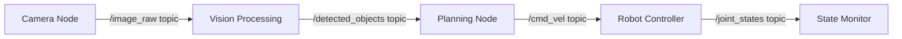

# Introduction to ROS 2

## What is ROS 2?

ROS 2 (Robot Operating System 2) is an open-source middleware framework for building complex robotic systems. Despite its name, **ROS 2 is not an operating system** - it's a collection of software libraries and tools that run on top of Linux (primarily Ubuntu).

### Key Characteristics

- **Middleware**: Provides communication infrastructure between software components
- **Modular**: Systems built from independent, reusable nodes
- **Language-agnostic**: Supports Python, C++, and other languages
- **Industry-standard**: Used in research, industry, and commercial products

:::tip Think of ROS 2 as...
A **nervous system** for robots - connecting sensors, actuators, and processing units so they can communicate and coordinate actions.
:::

## Why ROS 2 (vs ROS 1)?

ROS 2 addresses limitations of ROS 1:

| Feature | ROS 1 | ROS 2 |
|---------|-------|-------|
| **Real-time** | Limited | Supported (with DDS) |
| **Security** | Minimal | Built-in encryption |
| **Multi-robot** | Challenging | Native support |
| **Windows/macOS** | Poor support | Full support |
| **Production** | Research-focused | Production-ready |

ROS 2 is the **recommended version** for new projects (ROS 1 reached end-of-life in 2025).

## ROS 2 Architecture

### Computational Graph

ROS 2 systems form a **computational graph** where:
- **Nodes** are independent processes (vertices)
- **Topics, Services, Actions** are communication methods (edges)



**Figure 1.1**: Example computational graph with 5 nodes communicating via topics

### Core Concepts

#### 1. Nodes
Independent executable processes that perform specific tasks.

**Examples**:
- Camera driver node (publishes images)
- Object detector node (processes images)
- Motion planner node (generates trajectories)

#### 2. Topics
Named channels for asynchronous message passing (publish/subscribe pattern).

**Characteristics**:
- Many-to-many communication
- Asynchronous (non-blocking)
- Typed messages (e.g., sensor_msgs/Image)

#### 3. Services
Request/response communication for synchronous operations.

**Use cases**:
- Query robot state
- Trigger one-time actions
- Configuration changes

#### 4. Actions
Long-running tasks with feedback and cancellation support.

**Examples**:
- Navigate to goal (reports progress)
- Pick and place object (sends status updates)

<details>
<summary>Advanced: Parameters and Launch Files</summary>

**Parameters**: Configuration values that nodes can read/write dynamically.

**Launch Files**: Scripts to start multiple nodes with configurations in one command.

We'll cover these in detail in Chapter 1.4.

</details>

## Installation

### System Requirements

- **OS**: Ubuntu 22.04 LTS (Jammy Jellyfish)
- **Disk**: ~5GB free space
- **RAM**: 4GB minimum, 8GB recommended
- **CPU**: x86_64 or ARM64 architecture

### Install ROS 2 Humble

```bash title="Add ROS 2 apt repository"
# Ensure UTF-8 encoding
sudo apt update && sudo apt install locales
sudo locale-gen en_US en_US.UTF-8
sudo update-locale LC_ALL=en_US.UTF-8 LANG=en_US.UTF-8
export LANG=en_US.UTF-8

# Setup sources
sudo apt install software-properties-common
sudo add-apt-repository universe

# Add ROS 2 GPG key
sudo apt update && sudo apt install curl -y
sudo curl -sSL https://raw.githubusercontent.com/ros/rosdistro/master/ros.key -o /usr/share/keyrings/ros-archive-keyring.gpg

# Add repository to sources list
echo "deb [arch=$(dpkg --print-architecture) signed-by=/usr/share/keyrings/ros-archive-keyring.gpg] http://packages.ros.org/ros2/ubuntu $(. /etc/os-release && echo $UBUNTU_CODENAME) main" | sudo tee /etc/apt/sources.list.d/ros2.list > /dev/null
```

```bash title="Install ROS 2 packages"
# Update package index
sudo apt update

# Install ROS 2 Humble Desktop (full installation)
sudo apt install ros-humble-desktop

# Install development tools
sudo apt install ros-dev-tools
```

**Dependencies**:
- ros-humble-desktop (v0.10.0): Full ROS 2 with visualization tools
- python3-colcon-common-extensions: Build tool

**Expected Output**:
```
Reading package lists... Done
Building dependency tree... Done
The following NEW packages will be installed:
  ros-humble-desktop ros-humble-ros-base ...
0 upgraded, 523 newly installed, 0 to remove
```

### Environment Setup

Every terminal must source the ROS 2 setup script:

```bash title="Source ROS 2 environment"
source /opt/ros/humble/setup.bash
```

:::tip Pro Tip
Add this line to your `~/.bashrc` file to auto-source on terminal startup:

```bash
echo "source /opt/ros/humble/setup.bash" >> ~/.bashrc
```
:::

### Verify Installation

```bash title="Check ROS 2 version"
ros2 --version
```

**Expected Output**:
```
ros2 cli version: 0.18.5
```

```bash title="List available ROS 2 commands"
ros2 --help
```

You should see commands like: `run`, `topic`, `node`, `service`, `action`, `pkg`, etc.

## Your First ROS 2 Commands

### Introspection Commands

```bash title="List running nodes"
ros2 node list
```

```bash title="List available topics"
ros2 topic list
```

```bash title="Get information about a node"
ros2 node info /my_node_name
```

### Running Demo Nodes

ROS 2 includes demo packages. Let's run a talker/listener example:

**Terminal 1 - Run talker**:
```bash
ros2 run demo_nodes_cpp talker
```

**Expected Output**:
```
[INFO] [talker]: Publishing: 'Hello World: 1'
[INFO] [talker]: Publishing: 'Hello World: 2'
[INFO] [talker]: Publishing: 'Hello World: 3'
```

**Terminal 2 - Run listener**:
```bash
ros2 run demo_nodes_cpp listener
```

**Expected Output**:
```
[INFO] [listener]: I heard: [Hello World: 1]
[INFO] [listener]: I heard: [Hello World: 2]
[INFO] [listener]: I heard: [Hello World: 3]
```

**What's happening?**
- **Talker node** publishes messages to `/chatter` topic
- **Listener node** subscribes to `/chatter` and prints received messages
- Nodes communicate automatically via ROS 2 middleware

### Visualize the Graph

```bash title="View computational graph"
rqt_graph
```

This opens a GUI showing nodes and topics as a graph visualization.

:::warning Troubleshooting
**If `rqt_graph` command not found**: Install missing package
```bash
sudo apt install ros-humble-rqt-graph
```
:::

## Key Takeaways

1. **ROS 2 is middleware**, not an OS - it enables robot software components to communicate
2. **Computational graph** model: nodes communicate via topics, services, and actions
3. **Installation** requires Ubuntu 22.04 + apt packages
4. **Environment sourcing** mandatory in each terminal
5. **Demo nodes** demonstrate basic pub/sub communication

## Next Steps

Continue to [Chapter 1.2: Nodes and Topics](./1-2-nodes-topics.md) to learn how to create your own publisher and subscriber nodes.

## Additional Resources

- [ROS 2 Humble Documentation](https://docs.ros.org/en/humble/)
- [ROS 2 Design Overview](https://design.ros2.org/)
- **Glossary**: [Node](../resources/glossary.md#node), [Topic](../resources/glossary.md#topic), [Computational Graph](../resources/glossary.md#computational-graph)

---

**Next**: [1.2 Nodes and Topics](./1-2-nodes-topics.md) →
