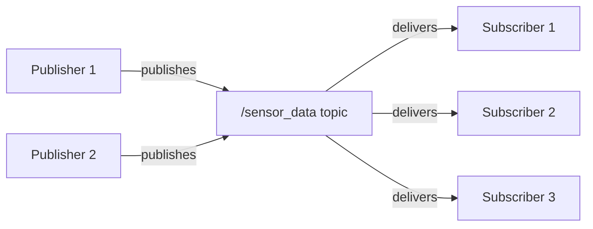

# Nodes and Topics

## Overview

In this chapter, you'll learn how ROS 2 nodes communicate using the **publish/subscribe** pattern. This is the most common communication method in ROS 2, enabling asynchronous, many-to-many data exchange between nodes.

By the end of this chapter, you will:
- Understand what nodes and topics are
- Create publisher nodes that send messages
- Create subscriber nodes that receive messages
- Use ROS 2 CLI tools to inspect running systems

## What are ROS 2 Nodes?

A **node** is the fundamental building block of a ROS 2 system. Each node is an independent process that performs a specific task.

### Node Characteristics

- **Single responsibility**: Each node should do one thing well
- **Independent**: Nodes can start, stop, and restart independently
- **Communicate via interfaces**: Nodes exchange data through topics, services, and actions
- **Language-agnostic**: Can be written in Python, C++, or other supported languages

### Real-World Examples

| Node | Purpose | Publishes | Subscribes |
|------|---------|-----------|------------|
| Camera Driver | Captures images | `/camera/image_raw` | - |
| Object Detector | Finds objects in images | `/detected_objects` | `/camera/image_raw` |
| Motion Planner | Plans robot movements | `/cmd_vel` | `/detected_objects` |
| Motor Controller | Drives motors | - | `/cmd_vel` |

## What are Topics?

A **topic** is a named channel for message passing between nodes. Topics follow the publish/subscribe pattern:

- **Publishers** send messages to a topic
- **Subscribers** receive messages from a topic
- **Many-to-many**: Multiple publishers and subscribers can share a topic



**Figure 1.2**: Multiple publishers and subscribers sharing a single topic

### Topic Characteristics

- **Asynchronous**: Publishers don't wait for subscribers
- **Typed**: Each topic has a specific message type (e.g., `std_msgs/String`)
- **Named**: Topics have unique names like `/camera/image` or `/robot/velocity`
- **QoS configurable**: Quality of Service settings control reliability

## Creating Your First Publisher

Let's create a publisher node that sends "Hello World" messages.

import Tabs from '@theme/Tabs';
import TabItem from '@theme/TabItem';

<Tabs>
  <TabItem value="python" label="Python" default>

```python title="minimal_publisher.py"
import rclpy
from rclpy.node import Node
from std_msgs.msg import String

class MinimalPublisher(Node):
    """A simple publisher node that sends string messages."""

    def __init__(self):
        super().__init__('minimal_publisher')

        # Create a publisher
        # - topic name: 'topic'
        # - message type: String
        # - queue size: 10
        self.publisher_ = self.create_publisher(String, 'topic', 10)

        # Create a timer that calls the callback every 0.5 seconds
        timer_period = 0.5  # seconds
        self.timer = self.create_timer(timer_period, self.timer_callback)
        self.count = 0

        self.get_logger().info('Publisher node started')

    def timer_callback(self):
        """Called every timer_period seconds to publish a message."""
        msg = String()
        msg.data = f'Hello World: {self.count}'
        self.publisher_.publish(msg)
        self.get_logger().info(f'Publishing: "{msg.data}"')
        self.count += 1

def main(args=None):
    rclpy.init(args=args)

    minimal_publisher = MinimalPublisher()

    try:
        rclpy.spin(minimal_publisher)
    except KeyboardInterrupt:
        pass
    finally:
        minimal_publisher.destroy_node()
        rclpy.shutdown()

if __name__ == '__main__':
    main()
```

  </TabItem>
  <TabItem value="cpp" label="C++">

```cpp title="minimal_publisher.cpp"
#include <chrono>
#include <memory>
#include <string>

#include "rclcpp/rclcpp.hpp"
#include "std_msgs/msg/string.hpp"

using namespace std::chrono_literals;

class MinimalPublisher : public rclcpp::Node
{
public:
    MinimalPublisher()
    : Node("minimal_publisher"), count_(0)
    {
        // Create a publisher
        publisher_ = this->create_publisher<std_msgs::msg::String>("topic", 10);

        // Create a timer that calls the callback every 500ms
        timer_ = this->create_wall_timer(
            500ms, std::bind(&MinimalPublisher::timer_callback, this));

        RCLCPP_INFO(this->get_logger(), "Publisher node started");
    }

private:
    void timer_callback()
    {
        auto message = std_msgs::msg::String();
        message.data = "Hello World: " + std::to_string(count_++);
        RCLCPP_INFO(this->get_logger(), "Publishing: '%s'", message.data.c_str());
        publisher_->publish(message);
    }

    rclcpp::TimerBase::SharedPtr timer_;
    rclcpp::Publisher<std_msgs::msg::String>::SharedPtr publisher_;
    size_t count_;
};

int main(int argc, char * argv[])
{
    rclcpp::init(argc, argv);
    rclcpp::spin(std::make_shared<MinimalPublisher>());
    rclcpp::shutdown();
    return 0;
}
```

  </TabItem>
</Tabs>

### Understanding the Publisher Code

Let's break down the key parts:

1. **Node initialization**: `super().__init__('minimal_publisher')` creates a node named "minimal_publisher"

2. **Publisher creation**:
   ```python
   self.publisher_ = self.create_publisher(String, 'topic', 10)
   ```
   - `String`: Message type from `std_msgs`
   - `'topic'`: Topic name
   - `10`: Queue size (buffers up to 10 messages)

3. **Timer**: Triggers `timer_callback()` every 0.5 seconds

4. **Publishing**: `self.publisher_.publish(msg)` sends the message

### Running the Publisher

```bash title="Terminal 1 - Run the publisher"
# Source ROS 2 environment
source /opt/ros/humble/setup.bash

# Run the publisher (if in a ROS 2 package)
ros2 run my_package minimal_publisher

# Or run directly with Python
python3 minimal_publisher.py
```

**Expected Output**:
```
[INFO] [minimal_publisher]: Publisher node started
[INFO] [minimal_publisher]: Publishing: "Hello World: 0"
[INFO] [minimal_publisher]: Publishing: "Hello World: 1"
[INFO] [minimal_publisher]: Publishing: "Hello World: 2"
```

## Creating Your First Subscriber

Now let's create a subscriber to receive those messages.

<Tabs>
  <TabItem value="python" label="Python" default>

```python title="minimal_subscriber.py"
import rclpy
from rclpy.node import Node
from std_msgs.msg import String

class MinimalSubscriber(Node):
    """A simple subscriber node that receives string messages."""

    def __init__(self):
        super().__init__('minimal_subscriber')

        # Create a subscription
        # - topic name: 'topic' (must match publisher)
        # - message type: String
        # - callback: called when message received
        # - queue size: 10
        self.subscription = self.create_subscription(
            String,
            'topic',
            self.listener_callback,
            10)

        self.get_logger().info('Subscriber node started, waiting for messages...')

    def listener_callback(self, msg):
        """Called when a message is received."""
        self.get_logger().info(f'I heard: "{msg.data}"')

def main(args=None):
    rclpy.init(args=args)

    minimal_subscriber = MinimalSubscriber()

    try:
        rclpy.spin(minimal_subscriber)
    except KeyboardInterrupt:
        pass
    finally:
        minimal_subscriber.destroy_node()
        rclpy.shutdown()

if __name__ == '__main__':
    main()
```

  </TabItem>
  <TabItem value="cpp" label="C++">

```cpp title="minimal_subscriber.cpp"
#include <memory>

#include "rclcpp/rclcpp.hpp"
#include "std_msgs/msg/string.hpp"

class MinimalSubscriber : public rclcpp::Node
{
public:
    MinimalSubscriber()
    : Node("minimal_subscriber")
    {
        // Create a subscription
        subscription_ = this->create_subscription<std_msgs::msg::String>(
            "topic", 10,
            std::bind(&MinimalSubscriber::topic_callback, this, std::placeholders::_1));

        RCLCPP_INFO(this->get_logger(), "Subscriber node started, waiting for messages...");
    }

private:
    void topic_callback(const std_msgs::msg::String & msg) const
    {
        RCLCPP_INFO(this->get_logger(), "I heard: '%s'", msg.data.c_str());
    }

    rclcpp::Subscription<std_msgs::msg::String>::SharedPtr subscription_;
};

int main(int argc, char * argv[])
{
    rclcpp::init(argc, argv);
    rclcpp::spin(std::make_shared<MinimalSubscriber>());
    rclcpp::shutdown();
    return 0;
}
```

  </TabItem>
</Tabs>

### Running Publisher and Subscriber Together

```bash title="Terminal 1 - Run the publisher"
python3 minimal_publisher.py
```

```bash title="Terminal 2 - Run the subscriber"
python3 minimal_subscriber.py
```

**Subscriber Output**:
```
[INFO] [minimal_subscriber]: Subscriber node started, waiting for messages...
[INFO] [minimal_subscriber]: I heard: "Hello World: 0"
[INFO] [minimal_subscriber]: I heard: "Hello World: 1"
[INFO] [minimal_subscriber]: I heard: "Hello World: 2"
```

## ROS 2 CLI Tools for Topics

ROS 2 provides command-line tools to inspect and debug your system.

### List All Topics

```bash
ros2 topic list
```

**Output**:
```
/parameter_events
/rosout
/topic
```

### Get Topic Info

```bash
ros2 topic info /topic
```

**Output**:
```
Type: std_msgs/msg/String
Publisher count: 1
Subscription count: 1
```

### Echo Topic Messages

```bash
ros2 topic echo /topic
```

**Output** (live stream):
```
data: Hello World: 42
---
data: Hello World: 43
---
```

### Publish from Command Line

```bash
ros2 topic pub /topic std_msgs/msg/String "data: 'Hello from CLI'"
```

### Check Publishing Rate

```bash
ros2 topic hz /topic
```

**Output**:
```
average rate: 2.000
    min: 0.499s max: 0.501s std dev: 0.00071s window: 10
```

## Message Types

ROS 2 includes many built-in message types in packages like `std_msgs`, `geometry_msgs`, and `sensor_msgs`.

### Common Message Types

| Package | Message | Use Case |
|---------|---------|----------|
| `std_msgs` | `String`, `Int32`, `Float64`, `Bool` | Simple data types |
| `geometry_msgs` | `Twist`, `Pose`, `Point` | Robot position/velocity |
| `sensor_msgs` | `Image`, `LaserScan`, `Imu` | Sensor data |
| `nav_msgs` | `Odometry`, `Path`, `OccupancyGrid` | Navigation |

### Inspecting Message Structure

```bash
ros2 interface show std_msgs/msg/String
```

**Output**:
```
string data
```

```bash
ros2 interface show geometry_msgs/msg/Twist
```

**Output**:
```
Vector3 linear
    float64 x
    float64 y
    float64 z
Vector3 angular
    float64 x
    float64 y
    float64 z
```

## Practical Example: Robot Velocity Controller

Let's create a more practical example - a velocity command publisher for a robot.

```python title="velocity_publisher.py"
import rclpy
from rclpy.node import Node
from geometry_msgs.msg import Twist

class VelocityPublisher(Node):
    """Publishes velocity commands to control a robot."""

    def __init__(self):
        super().__init__('velocity_publisher')

        # Publisher for velocity commands
        self.publisher_ = self.create_publisher(Twist, '/cmd_vel', 10)

        # Declare parameters with defaults
        self.declare_parameter('linear_speed', 0.5)
        self.declare_parameter('angular_speed', 0.0)

        # Timer for publishing at 10 Hz
        self.timer = self.create_timer(0.1, self.publish_velocity)

        self.get_logger().info('Velocity publisher started')

    def publish_velocity(self):
        """Publish velocity command based on parameters."""
        msg = Twist()

        # Get current parameter values
        msg.linear.x = self.get_parameter('linear_speed').value
        msg.angular.z = self.get_parameter('angular_speed').value

        self.publisher_.publish(msg)

def main(args=None):
    rclpy.init(args=args)
    node = VelocityPublisher()

    try:
        rclpy.spin(node)
    except KeyboardInterrupt:
        # Stop the robot before shutting down
        stop_msg = Twist()
        node.publisher_.publish(stop_msg)
        node.get_logger().info('Stopping robot')
    finally:
        node.destroy_node()
        rclpy.shutdown()

if __name__ == '__main__':
    main()
```

## Best Practices

:::tip Node Design Guidelines
1. **One node, one purpose**: Keep nodes focused on a single task
2. **Meaningful names**: Use descriptive topic names like `/camera/image_raw`
3. **Namespacing**: Use namespaces to organize topics (e.g., `/robot1/cmd_vel`)
4. **Queue sizes**: Choose appropriate queue sizes (10 is a reasonable default)
5. **Logging**: Use the node's logger for debugging
:::

:::warning Common Pitfalls
- **Topic name mismatch**: Publisher and subscriber topic names must match exactly
- **Message type mismatch**: Both ends must use the same message type
- **Forgetting to spin**: `rclpy.spin()` is required to process callbacks
- **Not sourcing ROS 2**: Always source the setup script in new terminals
:::

## Summary

In this chapter, you learned:

1. **Nodes** are independent processes that perform specific tasks
2. **Topics** are named channels for publish/subscribe communication
3. **Publishers** send messages to topics
4. **Subscribers** receive messages from topics
5. **CLI tools** help inspect and debug running systems

## Exercises

See [Module 1 Exercises](./exercises/module-1-exercises.md) for hands-on practice with publishers and subscribers.

---

**Next**: [1.3 Services and Actions](./1-3-services-actions.md) - Learn synchronous request/response communication
