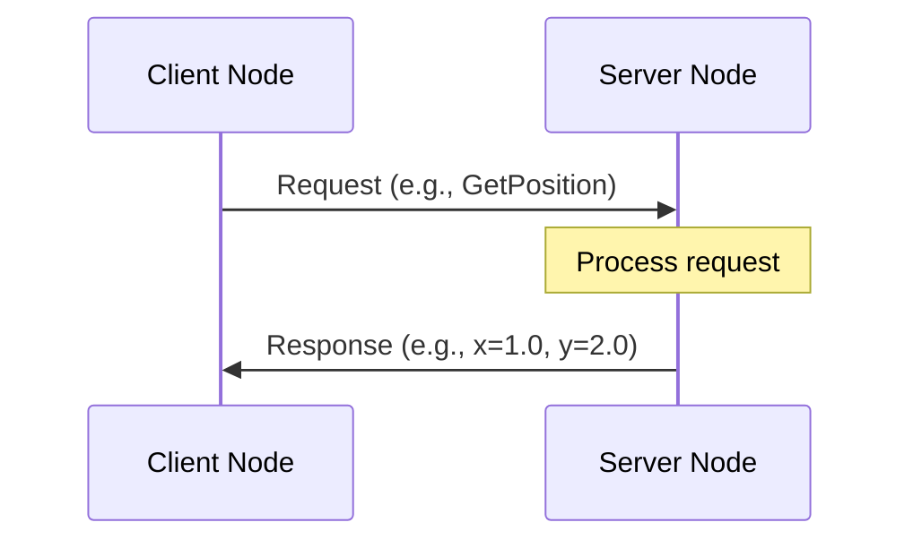
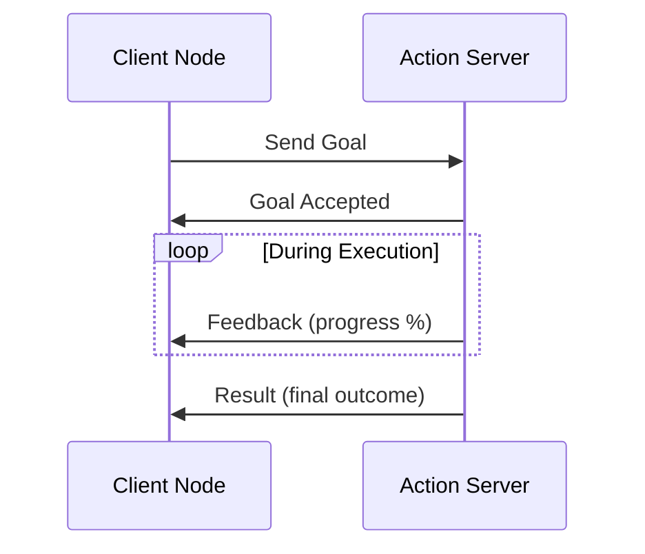
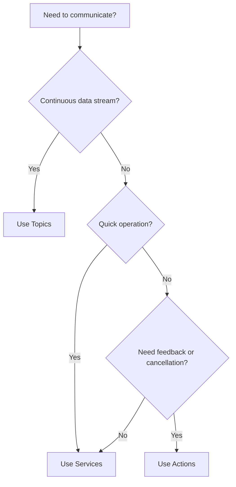

# Services and Actions

## Overview

While topics are great for continuous data streams, sometimes you need different communication patterns:

- **Services**: Synchronous request/response for quick operations
- **Actions**: Asynchronous tasks with progress feedback

This chapter teaches you when and how to use each pattern.

## Communication Patterns Comparison

| Feature | Topics | Services | Actions |
|---------|--------|----------|---------|
| **Pattern** | Publish/Subscribe | Request/Response | Goal/Feedback/Result |
| **Timing** | Asynchronous | Synchronous | Asynchronous |
| **Use Case** | Continuous data | Quick queries | Long-running tasks |
| **Feedback** | No | No | Yes |
| **Cancelable** | N/A | No | Yes |
| **Example** | Sensor readings | Get robot state | Navigate to goal |

## What are ROS 2 Services?

A **service** is a synchronous, one-to-one communication pattern where a client sends a request and waits for a response from a server.



**Figure 1.3**: Service request/response communication flow

### Service Characteristics

- **Synchronous**: Client blocks until response received
- **One-to-one**: Single server per service (multiple clients allowed)
- **Typed**: Uses `.srv` definition files (request/response pair)
- **Quick operations**: Not for long-running tasks

### When to Use Services

- Query current robot state
- Trigger one-time actions (e.g., take a photo)
- Configuration changes
- Simple calculations

## Creating a Service Server

Let's create a service that adds two integers.

import Tabs from '@theme/Tabs';
import TabItem from '@theme/TabItem';

<Tabs>
  <TabItem value="python" label="Python" default>

```python title="add_two_ints_server.py"
import rclpy
from rclpy.node import Node
from example_interfaces.srv import AddTwoInts

class AddTwoIntsServer(Node):
    """Service server that adds two integers."""

    def __init__(self):
        super().__init__('add_two_ints_server')

        # Create the service
        self.srv = self.create_service(
            AddTwoInts,              # Service type
            'add_two_ints',          # Service name
            self.add_two_ints_callback)  # Callback function

        self.get_logger().info('Service ready: add_two_ints')

    def add_two_ints_callback(self, request, response):
        """Process the service request."""
        response.sum = request.a + request.b
        self.get_logger().info(f'Request: {request.a} + {request.b} = {response.sum}')
        return response

def main(args=None):
    rclpy.init(args=args)
    node = AddTwoIntsServer()

    try:
        rclpy.spin(node)
    except KeyboardInterrupt:
        pass
    finally:
        node.destroy_node()
        rclpy.shutdown()

if __name__ == '__main__':
    main()
```

  </TabItem>
  <TabItem value="cpp" label="C++">

```cpp title="add_two_ints_server.cpp"
#include <memory>
#include "rclcpp/rclcpp.hpp"
#include "example_interfaces/srv/add_two_ints.hpp"

class AddTwoIntsServer : public rclcpp::Node
{
public:
    AddTwoIntsServer()
    : Node("add_two_ints_server")
    {
        service_ = this->create_service<example_interfaces::srv::AddTwoInts>(
            "add_two_ints",
            std::bind(&AddTwoIntsServer::add, this,
                std::placeholders::_1, std::placeholders::_2));

        RCLCPP_INFO(this->get_logger(), "Service ready: add_two_ints");
    }

private:
    void add(const std::shared_ptr<example_interfaces::srv::AddTwoInts::Request> request,
             std::shared_ptr<example_interfaces::srv::AddTwoInts::Response> response)
    {
        response->sum = request->a + request->b;
        RCLCPP_INFO(this->get_logger(), "Request: %ld + %ld = %ld",
            request->a, request->b, response->sum);
    }

    rclcpp::Service<example_interfaces::srv::AddTwoInts>::SharedPtr service_;
};

int main(int argc, char **argv)
{
    rclcpp::init(argc, argv);
    rclcpp::spin(std::make_shared<AddTwoIntsServer>());
    rclcpp::shutdown();
    return 0;
}
```

  </TabItem>
</Tabs>

## Creating a Service Client

Now let's create a client to call the service.

<Tabs>
  <TabItem value="python" label="Python" default>

```python title="add_two_ints_client.py"
import rclpy
from rclpy.node import Node
from example_interfaces.srv import AddTwoInts

class AddTwoIntsClient(Node):
    """Service client that requests addition of two integers."""

    def __init__(self):
        super().__init__('add_two_ints_client')

        # Create client
        self.cli = self.create_client(AddTwoInts, 'add_two_ints')

        # Wait for service to be available
        while not self.cli.wait_for_service(timeout_sec=1.0):
            self.get_logger().info('Waiting for service...')

        self.get_logger().info('Service available')

    def send_request(self, a, b):
        """Send a request and return the future."""
        request = AddTwoInts.Request()
        request.a = a
        request.b = b
        return self.cli.call_async(request)

def main(args=None):
    rclpy.init(args=args)

    client = AddTwoIntsClient()

    # Send request
    future = client.send_request(3, 5)

    # Wait for response
    rclpy.spin_until_future_complete(client, future)

    try:
        response = future.result()
        client.get_logger().info(f'Result: 3 + 5 = {response.sum}')
    except Exception as e:
        client.get_logger().error(f'Service call failed: {e}')
    finally:
        client.destroy_node()
        rclpy.shutdown()

if __name__ == '__main__':
    main()
```

  </TabItem>
  <TabItem value="cpp" label="C++">

```cpp title="add_two_ints_client.cpp"
#include <memory>
#include <chrono>
#include "rclcpp/rclcpp.hpp"
#include "example_interfaces/srv/add_two_ints.hpp"

using namespace std::chrono_literals;

int main(int argc, char **argv)
{
    rclcpp::init(argc, argv);

    auto node = rclcpp::Node::make_shared("add_two_ints_client");
    auto client = node->create_client<example_interfaces::srv::AddTwoInts>("add_two_ints");

    // Wait for service
    while (!client->wait_for_service(1s)) {
        RCLCPP_INFO(node->get_logger(), "Waiting for service...");
    }

    // Create request
    auto request = std::make_shared<example_interfaces::srv::AddTwoInts::Request>();
    request->a = 3;
    request->b = 5;

    // Send request
    auto future = client->async_send_request(request);

    // Wait for response
    if (rclcpp::spin_until_future_complete(node, future) ==
        rclcpp::FutureReturnCode::SUCCESS)
    {
        RCLCPP_INFO(node->get_logger(), "Result: 3 + 5 = %ld", future.get()->sum);
    } else {
        RCLCPP_ERROR(node->get_logger(), "Service call failed");
    }

    rclcpp::shutdown();
    return 0;
}
```

  </TabItem>
</Tabs>

### Running the Service Example

```bash title="Terminal 1 - Start the server"
python3 add_two_ints_server.py
```

```bash title="Terminal 2 - Run the client"
python3 add_two_ints_client.py
```

**Server Output**:
```
[INFO] [add_two_ints_server]: Service ready: add_two_ints
[INFO] [add_two_ints_server]: Request: 3 + 5 = 8
```

**Client Output**:
```
[INFO] [add_two_ints_client]: Service available
[INFO] [add_two_ints_client]: Result: 3 + 5 = 8
```

## Service CLI Tools

```bash title="List available services"
ros2 service list
```

```bash title="Get service type"
ros2 service type /add_two_ints
```

```bash title="Call service from CLI"
ros2 service call /add_two_ints example_interfaces/srv/AddTwoInts "{a: 10, b: 20}"
```

**Output**:
```
response:
example_interfaces.srv.AddTwoInts_Response(sum=30)
```

## What are ROS 2 Actions?

**Actions** are for long-running tasks that need:
- Progress feedback during execution
- The ability to be canceled
- A final result when complete



**Figure 1.4**: Action goal/feedback/result lifecycle

### Action Characteristics

- **Asynchronous**: Client continues while action executes
- **Cancelable**: Goals can be canceled mid-execution
- **Feedback**: Server sends periodic updates
- **Preemptable**: New goals can preempt current ones

### When to Use Actions

- Navigation to a goal position
- Robot arm manipulation tasks
- Any task taking more than a few seconds
- Tasks where progress monitoring is useful

## Creating an Action Server

Let's create an action server for a countdown timer (using Fibonacci as the action type for simplicity).

```python title="countdown_action_server.py"
import time
import rclpy
from rclpy.action import ActionServer, GoalResponse, CancelResponse
from rclpy.node import Node
from example_interfaces.action import Fibonacci

class CountdownActionServer(Node):
    """Action server that counts down and provides feedback."""

    def __init__(self):
        super().__init__('countdown_action_server')

        self._action_server = ActionServer(
            self,
            Fibonacci,
            'countdown',
            execute_callback=self.execute_callback,
            goal_callback=self.goal_callback,
            cancel_callback=self.cancel_callback)

        self.get_logger().info('Countdown action server ready')

    def goal_callback(self, goal_request):
        """Accept or reject a goal request."""
        self.get_logger().info(f'Received goal request: count to {goal_request.order}')
        return GoalResponse.ACCEPT

    def cancel_callback(self, goal_handle):
        """Accept or reject a cancel request."""
        self.get_logger().info('Received cancel request')
        return CancelResponse.ACCEPT

    async def execute_callback(self, goal_handle):
        """Execute the action and provide feedback."""
        self.get_logger().info('Executing goal...')

        feedback_msg = Fibonacci.Feedback()
        feedback_msg.partial_sequence = [0, 1]

        target = goal_handle.request.order

        for i in range(1, target):
            # Check for cancellation
            if goal_handle.is_cancel_requested:
                goal_handle.canceled()
                self.get_logger().info('Goal canceled')
                return Fibonacci.Result()

            # Compute next Fibonacci number
            feedback_msg.partial_sequence.append(
                feedback_msg.partial_sequence[i] + feedback_msg.partial_sequence[i - 1])

            # Publish feedback
            goal_handle.publish_feedback(feedback_msg)
            self.get_logger().info(f'Feedback: {feedback_msg.partial_sequence}')

            # Simulate work
            time.sleep(1)

        goal_handle.succeed()

        result = Fibonacci.Result()
        result.sequence = feedback_msg.partial_sequence
        self.get_logger().info(f'Goal succeeded: {result.sequence}')
        return result

def main(args=None):
    rclpy.init(args=args)
    node = CountdownActionServer()

    try:
        rclpy.spin(node)
    except KeyboardInterrupt:
        pass
    finally:
        node.destroy_node()
        rclpy.shutdown()

if __name__ == '__main__':
    main()
```

## Creating an Action Client

```python title="countdown_action_client.py"
import rclpy
from rclpy.action import ActionClient
from rclpy.node import Node
from example_interfaces.action import Fibonacci

class CountdownActionClient(Node):
    """Action client that sends goals and handles feedback."""

    def __init__(self):
        super().__init__('countdown_action_client')
        self._action_client = ActionClient(self, Fibonacci, 'countdown')

    def send_goal(self, order):
        """Send a goal to the action server."""
        goal_msg = Fibonacci.Goal()
        goal_msg.order = order

        self.get_logger().info(f'Sending goal: count to {order}')

        # Wait for server
        self._action_client.wait_for_server()

        # Send goal with feedback callback
        self._send_goal_future = self._action_client.send_goal_async(
            goal_msg,
            feedback_callback=self.feedback_callback)

        self._send_goal_future.add_done_callback(self.goal_response_callback)

    def goal_response_callback(self, future):
        """Handle goal acceptance/rejection."""
        goal_handle = future.result()

        if not goal_handle.accepted:
            self.get_logger().info('Goal rejected')
            return

        self.get_logger().info('Goal accepted')

        # Get result
        self._get_result_future = goal_handle.get_result_async()
        self._get_result_future.add_done_callback(self.get_result_callback)

    def feedback_callback(self, feedback_msg):
        """Handle feedback from the action server."""
        feedback = feedback_msg.feedback
        self.get_logger().info(f'Received feedback: {feedback.partial_sequence}')

    def get_result_callback(self, future):
        """Handle the final result."""
        result = future.result().result
        self.get_logger().info(f'Result: {result.sequence}')
        rclpy.shutdown()

def main(args=None):
    rclpy.init(args=args)

    client = CountdownActionClient()
    client.send_goal(10)  # Count to 10

    rclpy.spin(client)

if __name__ == '__main__':
    main()
```

### Running the Action Example

```bash title="Terminal 1 - Start the action server"
python3 countdown_action_server.py
```

```bash title="Terminal 2 - Run the action client"
python3 countdown_action_client.py
```

**Client Output** (with periodic feedback):
```
[INFO] [countdown_action_client]: Sending goal: count to 10
[INFO] [countdown_action_client]: Goal accepted
[INFO] [countdown_action_client]: Received feedback: [0, 1, 1]
[INFO] [countdown_action_client]: Received feedback: [0, 1, 1, 2]
[INFO] [countdown_action_client]: Received feedback: [0, 1, 1, 2, 3]
...
[INFO] [countdown_action_client]: Result: [0, 1, 1, 2, 3, 5, 8, 13, 21, 34, 55]
```

## Action CLI Tools

```bash title="List available actions"
ros2 action list
```

```bash title="Get action info"
ros2 action info /countdown
```

```bash title="Send goal from CLI"
ros2 action send_goal /countdown example_interfaces/action/Fibonacci "{order: 5}"
```

```bash title="Send goal with feedback"
ros2 action send_goal /countdown example_interfaces/action/Fibonacci "{order: 5}" --feedback
```

## Decision Guide: Topics vs Services vs Actions



### Quick Reference

| Scenario | Use |
|----------|-----|
| Camera images (30 fps) | Topic |
| Get current robot pose | Service |
| Navigate to waypoint | Action |
| LiDAR point clouds | Topic |
| Reset robot odometry | Service |
| Execute manipulation task | Action |
| IMU data | Topic |
| Set parameter value | Service |
| Record rosbag for 1 minute | Action |

## Best Practices

:::tip Service Design
1. **Keep services fast**: Operations should complete quickly (< 1 second)
2. **Use meaningful names**: `/robot/get_status` not `/gs`
3. **Handle errors gracefully**: Return error codes in response when appropriate
4. **Don't block**: Services shouldn't call other services (deadlock risk)
:::

:::tip Action Design
1. **Provide regular feedback**: Update progress at reasonable intervals
2. **Support cancellation**: Always check for cancel requests
3. **Handle preemption**: Define behavior when new goals arrive
4. **Clean up on failure**: Return partial results or error states
:::

:::warning Common Pitfalls
- **Using services for long tasks**: If it takes > 1 second, use an action
- **Forgetting to spin**: Both servers and clients need `rclpy.spin()`
- **Not waiting for server**: Always wait for service/action availability
- **Blocking in callbacks**: Don't do long operations in service callbacks
:::

## Summary

In this chapter, you learned:

1. **Services** provide synchronous request/response communication
2. **Actions** enable long-running tasks with feedback and cancellation
3. **CLI tools** help test and debug services and actions
4. Choose the right pattern based on your communication needs

## Exercises

See [Module 1 Exercises](./exercises/module-1-exercises.md) for hands-on practice with services and actions.

---

**Next**: [1.4 Parameters and Launch Files](./1-4-parameters.md) - Learn dynamic configuration and multi-node orchestration
