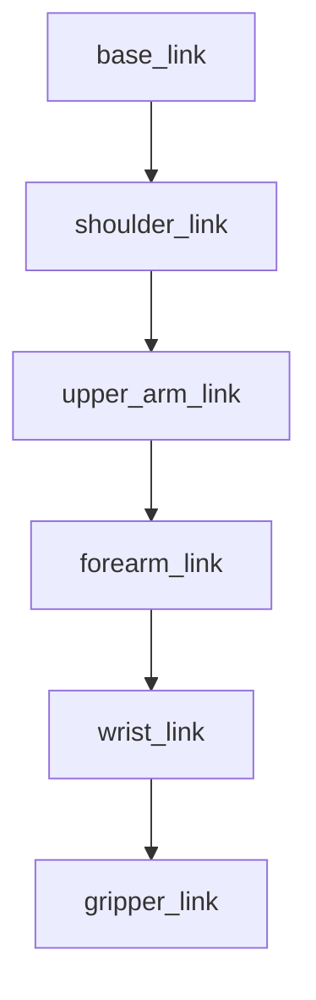

# URDF Robot Description

## Overview

URDF (Unified Robot Description Format) is an XML format for describing robot models in ROS 2. In this chapter, you'll learn to create robot descriptions that define:

- Physical structure (links and joints)
- Visual appearance (meshes, colors)
- Collision geometry
- Physical properties (mass, inertia)

## What is URDF?

**URDF** defines a robot as a tree of rigid bodies (links) connected by joints.



**Figure 1.5**: Kinematic tree of a simple robot arm

### Key Components

| Element | Purpose |
|---------|---------|
| `<robot>` | Root element, defines robot name |
| `<link>` | Rigid body with visual/collision geometry |
| `<joint>` | Connection between two links |
| `<material>` | Color or texture definition |

## URDF Structure

Every URDF file follows this basic structure:

```xml title="Basic URDF structure"
<?xml version="1.0"?>
<robot name="my_robot">
    <!-- Materials (colors) -->
    <material name="blue">
        <color rgba="0 0 0.8 1"/>
    </material>

    <!-- Links (rigid bodies) -->
    <link name="base_link">
        <!-- Visual, collision, inertial properties -->
    </link>

    <!-- Joints (connections) -->
    <joint name="joint1" type="revolute">
        <!-- Joint properties -->
    </joint>
</robot>
```

## Creating Links

A **link** represents a rigid body with three optional elements:

### Visual Properties

Define how the link appears in visualization tools:

```xml title="Link with visual geometry"
<link name="base_link">
    <visual>
        <origin xyz="0 0 0.025" rpy="0 0 0"/>
        <geometry>
            <box size="0.3 0.3 0.05"/>
        </geometry>
        <material name="blue"/>
    </visual>
</link>
```

### Collision Properties

Define the shape used for collision detection:

```xml title="Link with collision geometry"
<link name="base_link">
    <collision>
        <origin xyz="0 0 0.025" rpy="0 0 0"/>
        <geometry>
            <box size="0.3 0.3 0.05"/>
        </geometry>
    </collision>
</link>
```

### Inertial Properties

Define mass and inertia for physics simulation:

```xml title="Link with inertial properties"
<link name="base_link">
    <inertial>
        <origin xyz="0 0 0.025" rpy="0 0 0"/>
        <mass value="1.0"/>
        <inertia ixx="0.01" ixy="0" ixz="0"
                 iyy="0.01" iyz="0" izz="0.01"/>
    </inertial>
</link>
```

### Geometry Types

URDF supports several primitive shapes:

```xml title="Box geometry"
<geometry>
    <box size="0.5 0.3 0.1"/>  <!-- length width height -->
</geometry>
```

```xml title="Cylinder geometry"
<geometry>
    <cylinder radius="0.1" length="0.5"/>
</geometry>
```

```xml title="Sphere geometry"
<geometry>
    <sphere radius="0.1"/>
</geometry>
```

```xml title="Mesh geometry (for complex shapes)"
<geometry>
    <mesh filename="package://my_package/meshes/robot_part.stl" scale="1 1 1"/>
</geometry>
```

## Creating Joints

**Joints** connect links and define how they can move relative to each other.

### Joint Types

| Type | Description | DOF |
|------|-------------|-----|
| `fixed` | No movement | 0 |
| `revolute` | Rotation with limits | 1 |
| `continuous` | Unlimited rotation | 1 |
| `prismatic` | Linear sliding | 1 |
| `floating` | 6 DOF (rarely used) | 6 |
| `planar` | 2D movement | 2 |

### Joint Definition

```xml title="Revolute joint example"
<joint name="shoulder_joint" type="revolute">
    <parent link="base_link"/>
    <child link="shoulder_link"/>
    <origin xyz="0 0 0.05" rpy="0 0 0"/>
    <axis xyz="0 0 1"/>
    <limit lower="-1.57" upper="1.57" effort="100" velocity="1.0"/>
</joint>
```

### Joint Elements Explained

| Element | Purpose |
|---------|---------|
| `<parent>` | The parent link |
| `<child>` | The child link |
| `<origin>` | Position/orientation of joint in parent frame |
| `<axis>` | Axis of rotation/translation |
| `<limit>` | Motion limits (revolute/prismatic only) |

## Complete Robot Example

Let's build a simple two-link robot arm:

```xml title="simple_arm.urdf"
<?xml version="1.0"?>
<robot name="simple_arm">
    <!-- Materials -->
    <material name="blue">
        <color rgba="0 0 0.8 1"/>
    </material>
    <material name="orange">
        <color rgba="1 0.5 0 1"/>
    </material>
    <material name="gray">
        <color rgba="0.5 0.5 0.5 1"/>
    </material>

    <!-- Base Link (fixed to world) -->
    <link name="base_link">
        <visual>
            <origin xyz="0 0 0.025" rpy="0 0 0"/>
            <geometry>
                <cylinder radius="0.1" length="0.05"/>
            </geometry>
            <material name="gray"/>
        </visual>
        <collision>
            <origin xyz="0 0 0.025" rpy="0 0 0"/>
            <geometry>
                <cylinder radius="0.1" length="0.05"/>
            </geometry>
        </collision>
        <inertial>
            <mass value="1.0"/>
            <inertia ixx="0.01" ixy="0" ixz="0"
                     iyy="0.01" iyz="0" izz="0.01"/>
        </inertial>
    </link>

    <!-- Shoulder Link -->
    <link name="shoulder_link">
        <visual>
            <origin xyz="0 0 0.15" rpy="0 0 0"/>
            <geometry>
                <box size="0.05 0.05 0.3"/>
            </geometry>
            <material name="blue"/>
        </visual>
        <collision>
            <origin xyz="0 0 0.15" rpy="0 0 0"/>
            <geometry>
                <box size="0.05 0.05 0.3"/>
            </geometry>
        </collision>
        <inertial>
            <mass value="0.5"/>
            <origin xyz="0 0 0.15"/>
            <inertia ixx="0.005" ixy="0" ixz="0"
                     iyy="0.005" iyz="0" izz="0.001"/>
        </inertial>
    </link>

    <!-- Shoulder Joint (revolute) -->
    <joint name="shoulder_joint" type="revolute">
        <parent link="base_link"/>
        <child link="shoulder_link"/>
        <origin xyz="0 0 0.05" rpy="0 0 0"/>
        <axis xyz="0 1 0"/>
        <limit lower="-1.57" upper="1.57" effort="100" velocity="1.0"/>
    </joint>

    <!-- Elbow Link -->
    <link name="elbow_link">
        <visual>
            <origin xyz="0 0 0.1" rpy="0 0 0"/>
            <geometry>
                <box size="0.04 0.04 0.2"/>
            </geometry>
            <material name="orange"/>
        </visual>
        <collision>
            <origin xyz="0 0 0.1" rpy="0 0 0"/>
            <geometry>
                <box size="0.04 0.04 0.2"/>
            </geometry>
        </collision>
        <inertial>
            <mass value="0.3"/>
            <origin xyz="0 0 0.1"/>
            <inertia ixx="0.002" ixy="0" ixz="0"
                     iyy="0.002" iyz="0" izz="0.0005"/>
        </inertial>
    </link>

    <!-- Elbow Joint (revolute) -->
    <joint name="elbow_joint" type="revolute">
        <parent link="shoulder_link"/>
        <child link="elbow_link"/>
        <origin xyz="0 0 0.3" rpy="0 0 0"/>
        <axis xyz="0 1 0"/>
        <limit lower="-2.0" upper="2.0" effort="50" velocity="1.0"/>
    </joint>

    <!-- End Effector Link -->
    <link name="end_effector">
        <visual>
            <origin xyz="0 0 0.025" rpy="0 0 0"/>
            <geometry>
                <sphere radius="0.03"/>
            </geometry>
            <material name="gray"/>
        </visual>
    </link>

    <!-- End Effector Joint (fixed) -->
    <joint name="end_effector_joint" type="fixed">
        <parent link="elbow_link"/>
        <child link="end_effector"/>
        <origin xyz="0 0 0.2" rpy="0 0 0"/>
    </joint>
</robot>
```

## Visualizing in RViz

### Launch File for Visualization

```python title="launch/view_robot.launch.py"
from launch import LaunchDescription
from launch_ros.actions import Node
from launch.substitutions import Command
from ament_index_python.packages import get_package_share_directory
import os

def generate_launch_description():
    pkg_dir = get_package_share_directory('my_robot_description')
    urdf_file = os.path.join(pkg_dir, 'urdf', 'simple_arm.urdf')

    # Read URDF file
    with open(urdf_file, 'r') as file:
        robot_description = file.read()

    # Robot State Publisher
    robot_state_publisher = Node(
        package='robot_state_publisher',
        executable='robot_state_publisher',
        parameters=[{'robot_description': robot_description}]
    )

    # Joint State Publisher GUI
    joint_state_publisher_gui = Node(
        package='joint_state_publisher_gui',
        executable='joint_state_publisher_gui'
    )

    # RViz
    rviz = Node(
        package='rviz2',
        executable='rviz2',
        arguments=['-d', os.path.join(pkg_dir, 'rviz', 'view_robot.rviz')]
    )

    return LaunchDescription([
        robot_state_publisher,
        joint_state_publisher_gui,
        rviz
    ])
```

### Running the Visualization

```bash title="Install dependencies"
sudo apt install ros-humble-joint-state-publisher-gui
sudo apt install ros-humble-robot-state-publisher
sudo apt install ros-humble-rviz2
```

```bash title="Launch visualization"
ros2 launch my_robot_description view_robot.launch.py
```

### RViz Configuration

1. Add **RobotModel** display
2. Set **Fixed Frame** to `base_link`
3. Use the Joint State Publisher GUI to move joints

## Validating URDF

```bash title="Check URDF for errors"
check_urdf simple_arm.urdf
```

**Expected Output**:
```
robot name is: simple_arm
---------- Successfully Parsed XML ---------------
root Link: base_link has 1 child(ren)
    child(1):  shoulder_link
        child(1):  elbow_link
            child(1):  end_effector
```

```bash title="Visualize URDF tree"
urdf_to_graphiz simple_arm.urdf
```

This generates a PDF showing the kinematic tree.

## Xacro: URDF Macros

**Xacro** extends URDF with variables and macros for cleaner files:

```xml title="simple_arm.urdf.xacro"
<?xml version="1.0"?>
<robot xmlns:xacro="http://www.ros.org/wiki/xacro" name="simple_arm">

    <!-- Properties (variables) -->
    <xacro:property name="base_radius" value="0.1"/>
    <xacro:property name="link_length" value="0.3"/>
    <xacro:property name="link_width" value="0.05"/>

    <!-- Macro for creating arm links -->
    <xacro:macro name="arm_link" params="name length width color">
        <link name="${name}">
            <visual>
                <origin xyz="0 0 ${length/2}" rpy="0 0 0"/>
                <geometry>
                    <box size="${width} ${width} ${length}"/>
                </geometry>
                <material name="${color}"/>
            </visual>
            <collision>
                <origin xyz="0 0 ${length/2}" rpy="0 0 0"/>
                <geometry>
                    <box size="${width} ${width} ${length}"/>
                </geometry>
            </collision>
        </link>
    </xacro:macro>

    <!-- Use the macro -->
    <xacro:arm_link name="shoulder_link" length="${link_length}"
                    width="${link_width}" color="blue"/>
    <xacro:arm_link name="elbow_link" length="${link_length * 0.8}"
                    width="${link_width * 0.9}" color="orange"/>

</robot>
```

### Converting Xacro to URDF

```bash title="Process xacro file"
xacro simple_arm.urdf.xacro > simple_arm.urdf
```

Or use Command substitution in launch files:

```python
robot_description = Command(['xacro ', urdf_xacro_file])
```

## Common URDF Patterns

### Mobile Robot Base

```xml title="Differential drive base"
<link name="base_link">
    <visual>
        <geometry>
            <box size="0.4 0.3 0.1"/>
        </geometry>
    </visual>
</link>

<!-- Left wheel -->
<link name="left_wheel">
    <visual>
        <geometry>
            <cylinder radius="0.05" length="0.02"/>
        </geometry>
    </visual>
</link>

<joint name="left_wheel_joint" type="continuous">
    <parent link="base_link"/>
    <child link="left_wheel"/>
    <origin xyz="0.1 0.16 0" rpy="-1.5708 0 0"/>
    <axis xyz="0 0 1"/>
</joint>

<!-- Right wheel (similar) -->
```

### Sensor Mounts

```xml title="Camera mount"
<link name="camera_link">
    <visual>
        <geometry>
            <box size="0.02 0.08 0.02"/>
        </geometry>
    </visual>
</link>

<joint name="camera_joint" type="fixed">
    <parent link="base_link"/>
    <child link="camera_link"/>
    <origin xyz="0.2 0 0.1" rpy="0 0 0"/>
</joint>

<!-- Camera optical frame (standard convention) -->
<link name="camera_optical_frame"/>

<joint name="camera_optical_joint" type="fixed">
    <parent link="camera_link"/>
    <child link="camera_optical_frame"/>
    <origin xyz="0 0 0" rpy="-1.5708 0 -1.5708"/>
</joint>
```

## Best Practices

:::tip URDF Design
1. **Start with base_link**: All robots need a root link
2. **Use consistent units**: Meters, kilograms, radians
3. **Simplify collision**: Use primitives instead of meshes when possible
4. **Add inertia for simulation**: Required for Gazebo physics
5. **Use meaningful names**: `left_wheel_joint` not `joint1`
:::

:::warning Common Errors
- **Broken kinematic chain**: Every link must connect to base_link
- **Missing inertia**: Gazebo requires inertial properties
- **Wrong axis orientation**: Check joint axis directions
- **Mesh file not found**: Verify package paths
- **Invalid joint limits**: Lower must be less than upper
:::

## Summary

In this chapter, you learned:

1. **URDF structure** with links, joints, and materials
2. **Link properties**: visual, collision, and inertial
3. **Joint types** and their configurations
4. **RViz visualization** with robot_state_publisher
5. **Xacro macros** for cleaner, reusable URDFs

## Exercises

See [Module 1 Exercises](./exercises/module-1-exercises.md) for hands-on practice creating robot descriptions.

---

**Next**: [Module 1 Exercises](./exercises/module-1-exercises.md) - Practice all Module 1 concepts
