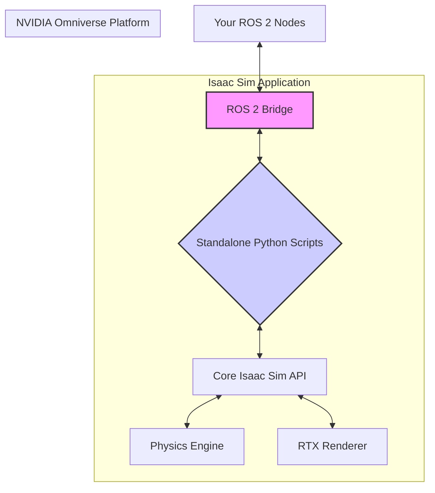

## Welcome to NVIDIA Isaac Sim on Omniverse

NVIDIA Isaac Sim is a scalable robotics simulation application and synthetic data generation tool that powers the next generation of AI-based robots. It is built on the NVIDIA Omniverse™ platform, a powerful, multi-GPU, real-time simulation and collaboration platform.

### Key Features of Isaac Sim

- **Photorealistic Rendering:** Leveraging NVIDIA's RTX technology, Isaac Sim can produce stunningly realistic visuals, which is crucial for training vision-based AI models.
- **Physics-Accurate Simulation:** It includes a high-performance physics engine that can accurately simulate robot dynamics, contacts, and articulations.
- **ROS/ROS 2 Integration:** Isaac Sim offers seamless integration with ROS and ROS 2, allowing you to connect your existing ROS-based software stack directly to the simulator.
- **Synthetic Data Generation:** It provides tools to generate large, labeled datasets from simulation to train perception models.

### Isaac Sim Architecture

Isaac Sim's architecture is layered, with the Omniverse platform at its core.


**Figure 3.1.1**: Simplified architecture of Isaac Sim.

You can interact with Isaac Sim in two main ways:
1.  **Directly via Python scripts:** Isaac Sim exposes a powerful Python API to control every aspect of the simulation.
2.  **Through ROS 2:** The built-in ROS 2 bridge allows Isaac Sim to subscribe to and publish on ROS 2 topics and services.

### Setting Up a Basic Scene

Unlike the text-based world files of Gazebo, Isaac Sim scenes are typically built and controlled through Python scripts. This "simulation as code" approach makes your simulations highly configurable, repeatable, and version-controllable.

Here is a Python script that creates a simple scene with a ground plane and spawns a robot from a URDF file.

```python title="simple_scene.py"
from omni.isaac.kit import SimulationApp

# Configuration for the simulation
config = {"headless": False}
simulation_app = SimulationApp(config)

from omni.isaac.core import World
from omni.isaac.core.robots import Robot
from omni.isaac.core.utils.nucleus import get_assets_root_path

# Create a new world
world = World()

# Add a ground plane
assets_root_path = get_assets_root_path()
if assets_root_path is None:
    # Handle case where Nucleus server is not found
    print("Could not find Nucleus server.")
else:
    asset_path = assets_root_path + "/Isaac/Environments/Simple_Room/simple_room.usd"
    world.scene.add_default_ground_plane()


# Add a robot from a URDF file
robot_asset_path = "path/to/your/robot.urdf"
robot = world.scene.add(
    Robot(
        prim_path="/world/my_robot",
        name="my_robot",
        position=[0, 0, 0.5],
        urdf_path=robot_asset_path
    )
)

# Add the world to the simulation
world.reset()

while simulation_app.is_running():
    world.step(render=True)

simulation_app.close()

```
This script initializes the simulation, creates a world, adds a ground plane, and loads a robot from its URDF file. The `while` loop runs the simulation step-by-step.

:::danger Hardware Note
NVIDIA Isaac Sim has significant hardware requirements. A recent **NVIDIA RTX GPU (20-series or later) is mandatory**. It runs on Linux, and you'll need to install it via the Omniverse Launcher. A free license is available for individual developers and academic use. Please check the official Isaac Sim documentation for the latest system requirements.
:::

This powerful platform opens up new possibilities for AI and robotics development, which we will explore in the upcoming chapters, starting with reinforcement learning. You can find more information about ROS 2 integration in the official documentation, which provides a more robust and feature-rich approach than this simple script. Cross-referencing [Module 1](/docs/module-1-ros2/index) and [Module 2](/docs/module-2-simulation/index) will be helpful.
