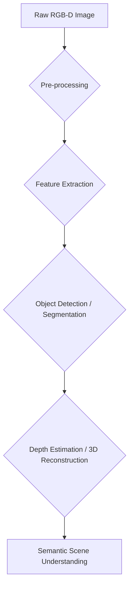

## Giving Robots Sight: Vision Processing Pipelines

Vision is a cornerstone of intelligent robot behavior. For a robot to understand its environment and act purposefully, it needs to be able to "see" and interpret the world around it. In VLA models, vision provides the crucial context for language instructions.

A **vision processing pipeline** is a sequence of operations applied to raw camera data (images) to extract meaningful information, such as objects, their locations, and scene geometry.

### Components of a Vision Pipeline


**Figure 4.1.1**: General vision processing pipeline for robotics.

1.  **Raw RGB-D Image:** Input from a camera, often including both color (RGB) and depth (D) information.
2.  **Pre-processing:** Operations like noise reduction, color correction, and resizing.
3.  **Feature Extraction:** Identifying salient points or patterns in the image.
4.  **Object Detection/Segmentation:** Identifying and locating specific objects, or classifying each pixel (segmentation).
5.  **Depth Estimation/3D Reconstruction:** Using depth data to understand the 3D geometry of the scene.
6.  **Semantic Scene Understanding:** Combining all extracted information to build a high-level understanding of the environment.

### Basic Image Processing with OpenCV

OpenCV (Open Source Computer Vision Library) is a widely used library for computer vision tasks. We can use it to perform basic operations on images received from a robot's camera.

First, ensure you have OpenCV installed for Python: `pip install opencv-python`.

```python title="image_processor.py"
import rclpy
from rclpy.node import Node
from sensor_msgs.msg import Image
from cv_bridge import CvBridge
import cv2

class ImageProcessor(Node):
    def __init__(self):
        super().__init__('image_processor')
        self.subscription = self.create_subscription(
            Image,
            '/camera/image_raw',
            self.image_callback,
            10)
        self.bridge = CvBridge()

    def image_callback(self, msg):
        try:
            # Convert ROS Image message to OpenCV image
            cv_image = self.bridge.imgmsg_to_cv2(msg, "bgr8")
        except Exception as e:
            self.get_logger().error(f"Error converting image: {e}")
            return

        # Convert to grayscale
        gray_image = cv2.cvtColor(cv_image, cv2.COLOR_BGR2GRAY)
        
        # Apply a simple blur
        blurred_image = cv2.GaussianBlur(gray_image, (5, 5), 0)

        # Edge detection
        edges = cv2.Canny(blurred_image, 50, 150)

        # Display results (for local debugging, not on a robot)
        cv2.imshow("Original", cv_image)
        cv2.imshow("Edges", edges)
        cv2.waitKey(1) # Refresh display

    def destroy_node(self):
        cv2.destroyAllWindows()
        super().destroy_node()

def main(args=None):
    rclpy.init(args=args)
    image_processor = ImageProcessor()
    rclpy.spin(image_processor)
    image_processor.destroy_node()
    rclpy.shutdown()

if __name__ == '__main__':
    main()
```
This node subscribes to a camera topic, converts the ROS image to an OpenCV format, performs grayscale conversion, blurring, and Canny edge detection.

### Object Detection with YOLO

Object detection is a deep learning task where the model identifies and localizes objects within an image by drawing bounding boxes around them and assigning class labels. YOLO (You Only Look Once) is a popular, real-time object detection model.

Integrating a pre-trained YOLO model (e.g., from `ultralytics` or `PyTorch Hub`) into your ROS 2 pipeline is straightforward. First, install `ultralytics`: `pip install ultralytics`.

```python title="yolo_detector.py"
import rclpy
from rclpy.node import Node
from sensor_msgs.msg import Image
from cv_bridge import CvBridge
import cv2
from ultralytics import YOLO

class YoloDetector(Node):
    def __init__(self):
        super().__init__('yolo_detector')
        self.subscription = self.create_subscription(
            Image,
            '/camera/image_raw',
            self.image_callback,
            10)
        self.bridge = CvBridge()
        self.model = YOLO('yolov8n.pt') # Load pre-trained YOLOv8 nano model

    def image_callback(self, msg):
        try:
            cv_image = self.bridge.imgmsg_to_cv2(msg, "bgr8")
        except Exception as e:
            self.get_logger().error(f"Error converting image: {e}")
            return

        # Perform inference
        results = self.model(cv_image, verbose=False) # verbose=False to suppress output

        # Draw bounding boxes and labels
        annotated_frame = results[0].plot() # YOLO's built-in plot function

        cv2.imshow("YOLO Detections", annotated_frame)
        cv2.waitKey(1)

    def destroy_node(self):
        cv2.destroyAllWindows()
        super().destroy_node()

def main(args=None):
    rclpy.init(args=args)
    yolo_detector = YoloDetector()
    rclpy.spin(yolo_detector)
    yolo_detector.destroy_node()
    rclpy.shutdown()

if __name__ == '__main__':
    main()
```
This node loads a pre-trained YOLOv8n model and performs object detection on incoming camera images, displaying the results with bounding boxes and labels.

:::warning Hardware Note
Running deep learning models like YOLO in real-time requires significant computational resources, primarily a powerful GPU. For deploying such pipelines on a physical robot, consider using embedded AI platforms like NVIDIA Jetson boards or industrial PCs with dedicated GPUs. The processing speed will directly impact the robot's reactive capabilities.
:::

With robust vision capabilities, our robots can now "see" the world. The next step is to enable them to "understand" human instructions using language models.
