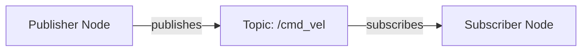

# Content Structure Contracts

**Date**: 2025-12-05
**Feature**: 001-robotics-textbook-mdx
**Purpose**: Define content organization patterns, conventions, and standards

## 1. MDX File Frontmatter Schema

All MDX content files MUST include YAML frontmatter with the following structure:

### Required Fields (All Content)

```yaml
---
id: string              # Unique identifier, matches filename
title: string           # Display title (H1 content)
description: string     # 1-2 sentence summary (120-160 chars for SEO)
keywords: array         # 3-7 relevant search terms
---
```

### Module Index Files (`index.md`)

```yaml
---
id: string                    # e.g., "module-1-ros2"
title: string                 # e.g., "Module 1: ROS 2"
sidebar_label: string         # Short label for sidebar, e.g., "Module 1"
description: string
keywords: array
module_number: number         # 1, 2, 3, 4, or 0 (capstone)
estimated_duration: string    # e.g., "2-3 weeks"
learning_outcomes: array      # List of outcome IDs or strings
prerequisites: array          # List of prerequisite descriptions
---
```

### Chapter Files

```yaml
---
id: string                    # e.g., "1-2-nodes-topics"
title: string                 # e.g., "Nodes and Topics"
sidebar_label: string         # e.g., "Nodes & Topics"
sidebar_position: number      # Order in sidebar (1, 2, 3...)
description: string
keywords: array
difficulty: enum              # beginner | intermediate | advanced
estimated_time: string        # e.g., "45-60 minutes"
learning_outcomes: array      # Outcome IDs this chapter addresses
prerequisites: array          # Chapter IDs required before this one
hardware_required: boolean    # Does this need physical hardware?
---
```

### Exercise Files

```yaml
---
id: string
title: string
sidebar_label: string
description: string
difficulty: enum              # beginner | intermediate | advanced
estimated_time: string
objective: string             # What learner will accomplish
validation_method: string     # How to verify success
---
```

---

## 2. Directory Structure Contract

### Root Structure

```
docs/                           # All MDX content
├── intro.md                    # Homepage (id: intro)
├── module-1-ros2/              # Module directories
├── module-2-simulation/
├── module-3-isaac/
├── module-4-vla/
├── capstone/
└── resources/                  # Appendices
```

### Module Directory Structure

```
docs/module-{number}-{slug}/
├── index.md                    # Module overview (required)
├── {chapter-id}.md             # Chapter files
├── {chapter-id}.md
└── exercises/                  # Exercise subdirectory (optional)
    └── {exercise-name}.md
```

**Rules**:
- Module directories MUST be named `module-{number}-{slug}`
- Chapter files MUST be named `{module-number}-{chapter-number}-{slug}.md`
- Exercise subdirectory is optional but MUST be named `exercises/` if present
- All module indexes MUST be named `index.md`

---

## 3. Sidebar Navigation Contract

Navigation is defined in `sidebars.js` following this structure:

```javascript
module.exports = {
  tutorialSidebar: [
    'intro',  // Homepage
    {
      type: 'category',
      label: 'Module 1: ROS 2',
      link: {type: 'doc', id: 'module-1-ros2/index'},
      collapsed: false,
      items: [
        'module-1-ros2/1-1-ros2-intro',
        'module-1-ros2/1-2-nodes-topics',
        'module-1-ros2/1-3-services-actions',
        // ... more chapters
        {
          type: 'category',
          label: 'Exercises',
          items: [
            'module-1-ros2/exercises/module-1-exercises',
          ],
        },
      ],
    },
    // ... more modules
    {
      type: 'category',
      label: 'Resources',
      items: [
        'resources/glossary',
        'resources/hardware-specs',
        'resources/software-setup',
        'resources/further-reading',
      ],
    },
  ],
};
```

**Rules**:
- Modules MUST be categories with link to index
- Modules SHOULD be `collapsed: false` for current module being authored
- Chapters MUST be ordered by chapter number
- Exercises MAY be in subcategory or inline
- Resources MUST be at end of sidebar

---

## 4. Code Block Standards

### Syntax Highlighting

All code blocks MUST specify language identifier:

````mdx
```python title="temperature_publisher.py"
import rclpy
# ... code
```
````

**Supported Languages**:
- `python` - Python code
- `cpp` - C++ code
- `bash` - Shell commands
- `xml` - URDF, launch files, XML configs
- `yaml` - ROS 2 parameters, config files
- `json` - JSON configs
- `javascript` / `typescript` - JS/TS code
- `jsx` / `tsx` - React components

### Title Attribute

Use `title` attribute for filenames or descriptive titles:

````mdx
```python title="publisher_example.py"
# Code here
```

```bash title="Installing ROS 2"
sudo apt install ros-humble-desktop
```
````

### Inline Annotations

Use comments to explain non-obvious code:

```python
def timer_callback(self):
    msg = String()
    msg.data = f'Hello: {self.i}'
    self.publisher_.publish(msg)  # Send message to topic
    self.get_logger().info(f'Publishing: "{msg.data}"')  # Log for debugging
    self.i += 1
```

**Rules**:
- At least one comment per 10 lines for complex logic
- Comments explain *why*, not *what* (avoid "increment counter" for `i += 1`)
- Use inline comments for single-line explanations
- Use block comments for multi-line explanations

---

## 5. Cross-Reference Patterns

### Internal Links

Use relative paths for internal links:

```mdx
See [ROS 2 Introduction](./1-1-ros2-intro.md) for architecture overview.

For service patterns, refer to [Services and Actions](./1-3-services-actions.md#services).

This builds on concepts from [Module 1](../module-1-ros2/index.md).
```

**Rules**:
- Always use `.md` extension (Docusaurus transforms to URLs)
- Use relative paths (`./` or `../`)
- Include anchors for specific sections (`#heading-slug`)
- Link text MUST be descriptive ("see Node documentation" not "click here")

### External Links

External links should open in new tab (add target and rel):

```mdx
See the [ROS 2 Documentation](https://docs.ros.org/en/humble/) for details.
```

Docusaurus handles external links automatically, but for explicit control:

```mdx
<a href="https://docs.ros.org" target="_blank" rel="noopener noreferrer">ROS 2 Docs</a>
```

### Glossary References

Link to glossary entries on first use in each chapter:

```mdx
A [**topic**](../resources/glossary.md#topic) is a named communication channel...
```

Bold the term, link to glossary anchor.

---

## 6. Code Tab Patterns

Use tabs for alternative approaches (Gazebo vs Unity, Python vs C++):

```mdx
import Tabs from '@theme/Tabs';
import TabItem from '@theme/TabItem';

<Tabs>
  <TabItem value="gazebo" label="Gazebo" default>

```xml title="robot.world"
<world name="default">
  <include><uri>model://ground_plane</uri></include>
</world>
```

  </TabItem>
  <TabItem value="unity" label="Unity">

```csharp title="RobotSetup.cs"
GameObject plane = GameObject.CreatePrimitive(PrimitiveType.Plane);
```

  </TabItem>
</Tabs>
```

**Rules**:
- Import Tabs components at top of file
- Use `default` prop on preferred option
- Tab `value` MUST be lowercase-kebab-case
- Tab `label` is display text (can have spaces, caps)
- Leave blank line before and after code blocks inside TabItem
- Group related code (don't mix unrelated examples)

---

## 7. Collapsible Content Patterns

### Admonitions with Collapsibles

For advanced content, use admonitions with `<details>`:

```mdx
:::tip Advanced Topic
<details>
<summary>Quaternion Mathematics Deep Dive</summary>

Quaternions represent rotations as 4D complex numbers...

$$
q = w + xi + yj + zk
$$

Where $w^2 + x^2 + y^2 + z^2 = 1$

</details>
:::
```

**Admonition Types**:
- `:::note` - General information (blue)
- `:::tip` - Helpful suggestions (green)
- `:::info` - Important information (cyan)
- `:::warning` - Warnings or caveats (orange)
- `:::danger` - Critical warnings (red)

### Exercise Solutions

Exercise solutions MUST be in collapsibles:

```mdx
## Exercise: Create a Temperature Publisher

... instructions ...

<details>
<summary>Show Solution</summary>

```python title="temperature_publisher.py"
import rclpy
from rclpy.node import Node
# ... solution code
```

**Explanation**: This solution uses...

</details>
```

**Rules**:
- Summary MUST be "Show Solution" (consistent language)
- Include explanation after code
- Never show solution before instructions
- Solutions must be tested and functional

---

## 8. Diagram Standards

### Mermaid Diagrams

Use Mermaid for flowcharts, sequence diagrams, state machines:

````mdx


**Figure 1.2**: ROS 2 Publisher/Subscriber Architecture
````

**Rules**:
- Always include caption below diagram
- Use semantic labels (not generic "A", "B", "C")
- Test in both light and dark modes
- Keep diagrams simple (< 10 nodes)

### Image Placeholders

For complex visuals, use admonition placeholders:

```mdx
:::info Diagram Placeholder: Humanoid Kinematic Chain
**Description**: 3D rendering of humanoid robot leg showing:
- 6 degrees of freedom (hip, knee, ankle joints)
- Coordinate frames at each joint (X: red, Y: green, Z: blue)
- Joint angles labeled (θ1-θ6)
- DH parameter table below

**Suggested Tool**: Blender or Inkscape
**Dimensions**: 1200x800px, light/dark mode compatible
**Alt Text**: "Humanoid robot leg kinematic chain with coordinate frames and DH parameters"
:::
```

**Rules**:
- Use `:::info` admonition type
- Title format: "Diagram Placeholder: {Descriptive Name}"
- Include all fields: Description, Suggested Tool, Dimensions, Alt Text
- Alt text MUST describe content, not just title

---

## 9. Mathematical Equations

Use KaTeX for math rendering:

### Inline Math

```mdx
The rotation matrix is defined as $R = \cos(\theta)I + \sin(\theta)[k]_\times$
```

### Block Math

```mdx
The Denavit-Hartenberg transformation is:

$$
T_i = \begin{bmatrix}
\cos(\theta_i) & -\sin(\theta_i)\cos(\alpha_i) & \sin(\theta_i)\sin(\alpha_i) & a_i\cos(\theta_i) \\
\sin(\theta_i) & \cos(\theta_i)\cos(\alpha_i) & -\cos(\theta_i)\sin(\alpha_i) & a_i\sin(\theta_i) \\
0 & \sin(\alpha_i) & \cos(\alpha_i) & d_i \\
0 & 0 & 0 & 1
\end{bmatrix}
$$
```

**Rules**:
- Use single `$` for inline math
- Use `$$` for display math (centered, larger)
- Define variables before using them
- Include units where applicable (e.g., "$\theta$ in radians")

---

## 10. Hardware Notes Pattern

Use warning admonitions for hardware-specific guidance:

```mdx
:::warning Hardware Note
**Simulation**: This example runs in Gazebo simulation without physical hardware.

**Real Hardware**: To run on a physical robot:
1. Replace `use_sim_time:=true` with `use_sim_time:=false`
2. Ensure robot is powered and connected via USB/network
3. Verify `/dev/ttyUSB0` permissions: `sudo chmod 666 /dev/ttyUSB0`

**Cost**: Physical setup requires Jetson Nano ($149) + motors ($80-$200). See [Hardware Specs](../resources/hardware-specs.md) for details.
:::
```

**Rules**:
- Use `:::warning` type for visibility
- Title MUST be "Hardware Note"
- Include three sections: Simulation, Real Hardware, Cost
- Cost MUST reference hardware specs appendix

---

## 11. Exercise Format Contract

Standard exercise structure:

```mdx
## Exercise {Number}: {Title}

**Difficulty**: {beginner|intermediate|advanced}
**Estimated Time**: {time range}
**Prerequisites**: {list of concepts or chapters}

### Objective

{Clear statement of what learner will accomplish}

### Instructions

1. {Numbered step}
2. {Numbered step}
3. {Numbered step}

### Validation

{How to verify the exercise is completed correctly}

**Expected Output**:
```
{Example of correct output}
```

### Hints

<details>
<summary>Hint 1: {Brief hint topic}</summary>
{Detailed hint}
</details>

<details>
<summary>Hint 2: {Brief hint topic}</summary>
{Detailed hint}
</details>

### Solution

<details>
<summary>Show Solution</summary>

```{language} title="{filename}"
{Solution code}
```

**Explanation**: {Why this solution works, key concepts}

</details>
```

**Rules**:
- Difficulty must match chapter difficulty
- Prerequisites MUST reference existing content
- Validation must be objective (not "it works")
- Include expected output for verification
- Hints are progressive (start generic, get specific)
- Solution includes explanation

---

## 12. Frontmatter Validation Schema

JSON Schema for automated validation:

```json
{
  "$schema": "http://json-schema.org/draft-07/schema#",
  "type": "object",
  "required": ["id", "title", "description", "keywords"],
  "properties": {
    "id": {
      "type": "string",
      "pattern": "^[a-z0-9-]+$"
    },
    "title": {
      "type": "string",
      "minLength": 5,
      "maxLength": 100
    },
    "sidebar_label": {
      "type": "string",
      "maxLength": 30
    },
    "description": {
      "type": "string",
      "minLength": 50,
      "maxLength": 200
    },
    "keywords": {
      "type": "array",
      "minItems": 3,
      "maxItems": 10,
      "items": {"type": "string"}
    },
    "difficulty": {
      "type": "string",
      "enum": ["beginner", "intermediate", "advanced"]
    },
    "estimated_time": {
      "type": "string",
      "pattern": "^[0-9]+-[0-9]+ (minutes|hours|weeks)$"
    }
  }
}
```

This enables CI/CD validation of frontmatter compliance.

---

## 13. File Naming Conventions

### Modules

- **Format**: `module-{number}-{slug}/index.md`
- **Example**: `module-1-ros2/index.md`
- **Slug rules**: Lowercase, hyphens only, no underscores, max 20 chars

### Chapters

- **Format**: `{module-number}-{chapter-number}-{slug}.md`
- **Example**: `1-2-nodes-topics.md`
- **Chapter number**: Two digits within module (01-99)

### Exercises

- **Format**: `exercises/{descriptive-name}.md` OR `module-{number}-exercises.md`
- **Example**: `exercises/temperature-publisher.md` OR `module-1-exercises.md`

### Resources

- **Format**: `{descriptive-name}.md`
- **Example**: `glossary.md`, `hardware-specs.md`, `software-setup.md`

### Images

- **Format**: `static/img/{category}/{descriptive-name}.{ext}`
- **Example**: `static/img/diagrams/ros2-architecture.svg`
- **Categories**: `diagrams/`, `hardware/`, `screenshots/`, `logos/`

---

## 14. Content Style Guidelines

### Voice and Tone

- **Second person**: "You will create..." not "One creates..." or "The reader creates..."
- **Active voice**: "The publisher sends..." not "The message is sent by..."
- **Present tense**: "ROS 2 uses..." not "ROS 2 will use..."
- **Instructional**: Direct, clear, no unnecessary jargon

### Formatting

- **Bold** for emphasis and first use of key terms
- *Italic* for technical terms, file names, variables
- `Code font` for commands, code snippets, package names
- **Lists**: Use numbered lists for sequences, bullet lists for collections

### Heading Hierarchy

- H1 (`#`): Page title (from frontmatter, don't repeat in content)
- H2 (`##`): Major sections
- H3 (`###`): Subsections
- H4 (`####`): Sub-subsections (use sparingly)
- Never skip levels (H2 → H4)

---

## 15. Content Review Checklist

Before committing new content, verify:

- [ ] Frontmatter complete and valid
- [ ] All code blocks have language identifiers
- [ ] All diagrams have alt text
- [ ] All internal links use relative paths
- [ ] All external links work (no 404s)
- [ ] Code examples tested in documented environment
- [ ] Exercise solutions verified
- [ ] Math equations render correctly
- [ ] Content works in light AND dark modes
- [ ] Heading hierarchy correct (no skipped levels)
- [ ] File naming follows conventions
- [ ] Glossary terms linked on first use
- [ ] Hardware notes included where applicable

---

## Contract Evolution

This contract is versioned with the textbook. Changes require:
1. Proposal documenting rationale
2. Review by content team
3. Update to this document
4. Migration guide for existing content (if breaking change)

**Current Version**: 1.0.0 (2025-12-05)
