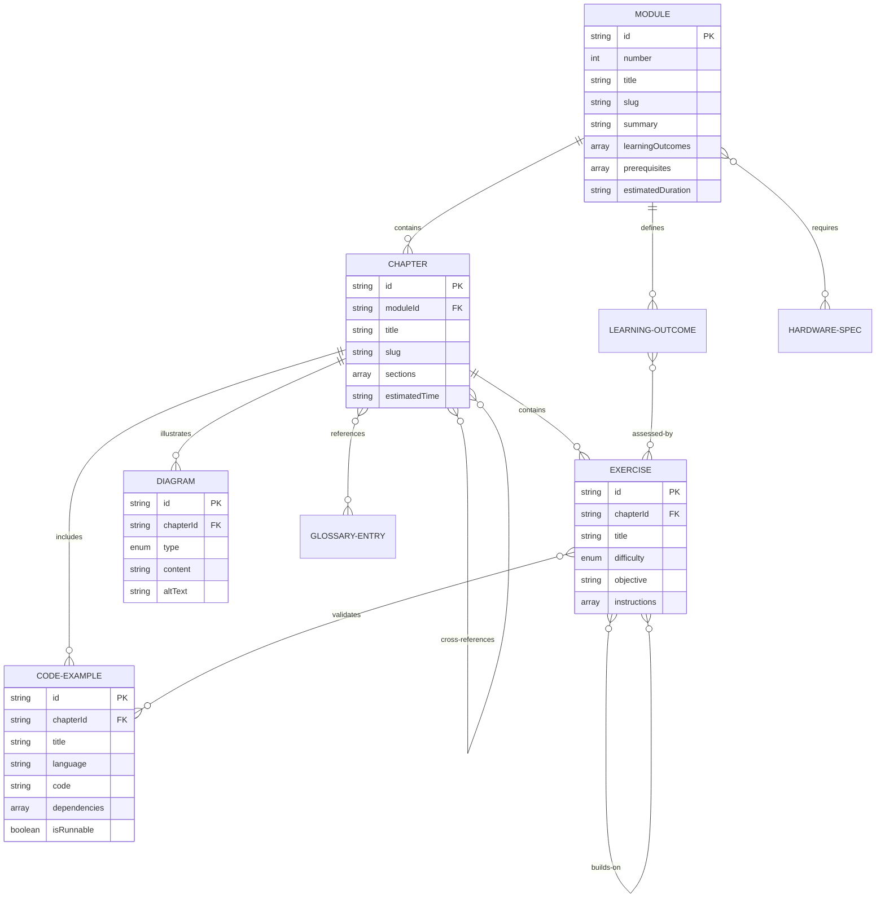

# Data Model: Physical AI & Humanoid Robotics Textbook

**Date**: 2025-12-05
**Feature**: 001-robotics-textbook-mdx
**Purpose**: Define content entities, attributes, relationships, and validation rules

## Overview

This document defines the structure of educational content entities. Unlike traditional software data models (databases, APIs), this model describes the organization and relationships of MDX documentation content.

## Entity Definitions

### 1. Module

**Description**: Top-level organizational unit representing a major learning area (e.g., Module 1: ROS 2).

**Attributes**:
- `id` (string, required): Unique identifier, format: `module-{number}-{slug}` (e.g., `module-1-ros2`)
- `number` (integer, required): Sequential number (1-4, plus capstone)
- `title` (string, required): Display title (e.g., "ROS 2: Robotic Nervous System")
- `slug` (string, required): URL-friendly identifier (e.g., `ros2`)
- `summary` (string, required): 1-2 sentence overview (100-200 chars)
- `learningOutcomes` (array of strings, required): 3-5 measurable outcomes
- `prerequisites` (array of strings, required): Required knowledge/skills
- `estimatedDuration` (string, required): Expected completion time (e.g., "2-3 weeks")
- `chapters` (array of Chapter IDs, required): Ordered list of contained chapters

**Relationships**:
- **Contains many**: Chapters (1:N)
- **References**: Prerequisites may link to other Modules or external resources
- **Followed by**: Next Module in learning sequence (1:1 optional)

**Validation Rules**:
- Module numbers must be unique and sequential
- Must contain at least 3 chapters
- Learning outcomes must be measurable (start with verbs: "explain", "implement", "demonstrate")
- Prerequisites must either reference existing content or be self-contained descriptions

**Example**:
```yaml
id: module-1-ros2
number: 1
title: "Module 1: ROS 2 (Robotic Nervous System)"
slug: ros2
summary: "Learn the fundamentals of ROS 2, the Robot Operating System, including nodes, topics, services, and robot description formats."
learningOutcomes:
  - "Explain ROS 2 architecture and core concepts"
  - "Implement publisher/subscriber nodes in Python"
  - "Create robot descriptions using URDF"
  - "Configure and launch multi-node ROS 2 systems"
prerequisites:
  - "Basic Python programming (functions, classes, modules)"
  - "Linux command line familiarity (cd, ls, mkdir)"
  - "Understanding of processes and inter-process communication"
estimatedDuration: "2-3 weeks"
chapters:
  - "1-1-ros2-intro"
  - "1-2-nodes-topics"
  - "1-3-services-actions"
  - "1-4-parameters"
  - "1-5-urdf"
```

---

### 2. Chapter

**Description**: Individual lesson within a module covering a specific topic.

**Attributes**:
- `id` (string, required): Format: `{module-number}-{chapter-number}-{slug}` (e.g., `1-2-nodes-topics`)
- `title` (string, required): Display title (e.g., "Nodes and Topics")
- `slug` (string, required): URL segment (e.g., `nodes-topics`)
- `moduleId` (string, required): Parent module ID
- `sections` (array of objects, required): Content sections with headings
- `codeExamples` (array of CodeExample IDs, required): Minimum 1 per chapter
- `exercises` (array of Exercise IDs, optional): Practice tasks
- `diagrams` (array of Diagram IDs, required): Visual content
- `crossReferences` (array of strings, optional): Links to related chapters
- `hardwareNotes` (string, optional): Hardware/software deployment guidance
- `estimatedTime` (string, required): Reading/practice time (e.g., "45-60 minutes")

**Relationships**:
- **Belongs to**: Module (N:1)
- **Contains many**: CodeExamples (1:N)
- **Contains many**: Exercises (1:N optional)
- **Contains many**: Diagrams (1:N)
- **References**: Other Chapters via crossReferences (N:N)

**Validation Rules**:
- Chapter numbering must follow `{module-number}-{chapter-number}` convention
- Must contain at least 1 code example (per FR-006)
- Must contain at least 1 diagram or diagram placeholder (per FR-019)
- Sections must follow logical progression (intro → explanation → examples → exercises)
- Cross-references must point to existing chapters

**Example**:
```yaml
id: 1-2-nodes-topics
title: "Nodes and Topics"
slug: nodes-topics
moduleId: module-1-ros2
sections:
  - heading: "What are ROS 2 Nodes?"
    content: "Explanation of nodes as processes..."
  - heading: "Publisher/Subscriber Pattern"
    content: "How nodes communicate via topics..."
  - heading: "Creating Your First Node"
    content: "Step-by-step node creation..."
codeExamples:
  - "example-simple-publisher"
  - "example-simple-subscriber"
  - "example-talker-listener"
exercises:
  - "exercise-create-temperature-publisher"
  - "exercise-multi-topic-subscriber"
diagrams:
  - "diagram-node-topic-architecture"
  - "diagram-pubsub-flow"
crossReferences:
  - "1-1-ros2-intro (ROS 2 architecture basics)"
  - "1-3-services-actions (synchronous communication)"
hardwareNotes: "This chapter uses simulation only. No physical hardware required."
estimatedTime: "45-60 minutes"
```

---

### 3. CodeExample

**Description**: Runnable or near-runnable code snippet demonstrating a concept.

**Attributes**:
- `id` (string, required): Format: `example-{descriptive-name}` (e.g., `example-simple-publisher`)
- `title` (string, required): Descriptive title (e.g., "Simple ROS 2 Publisher")
- `language` (string, required): Programming language (e.g., `python`, `cpp`, `xml`, `bash`)
- `code` (string, required): The actual code content
- `dependencies` (array of objects, required): Required packages/versions
- `expectedOutput` (string, optional): What running the code produces
- `troubleshooting` (array of objects, optional): Common errors and solutions
- `isRunnable` (boolean, required): True if can execute as-is, false if pseudocode/partial
- `requiresHardware` (boolean, required): True if needs physical hardware to run
- `tested` (boolean, required): Whether code has been validated
- `testedEnvironment` (string, required if tested=true): Environment where validated

**Relationships**:
- **Belongs to**: Chapter (N:1)
- **References**: Dependencies (external packages)

**Validation Rules**:
- Language must be valid Prism identifier for syntax highlighting
- If `isRunnable=true`, must include dependencies and expected output
- If `requiresHardware=true`, must include simulation alternative in `troubleshooting`
- Code must follow style guide (PEP 8 for Python, etc.)
- Must include comments explaining non-obvious logic

**Example**:
```yaml
id: example-simple-publisher
title: "Simple ROS 2 Publisher"
language: python
code: |
  import rclpy
  from rclpy.node import Node
  from std_msgs.msg import String

  class MinimalPublisher(Node):
      def __init__(self):
          super().__init__('minimal_publisher')
          self.publisher_ = self.create_publisher(String, 'topic', 10)
          self.timer = self.create_timer(0.5, self.timer_callback)
          self.i = 0

      def timer_callback(self):
          msg = String()
          msg.data = f'Hello World: {self.i}'
          self.publisher_.publish(msg)
          self.get_logger().info(f'Publishing: "{msg.data}"')
          self.i += 1

  def main(args=None):
      rclpy.init(args=args)
      node = MinimalPublisher()
      rclpy.spin(node)
      node.destroy_node()
      rclpy.shutdown()

  if __name__ == '__main__':
      main()
dependencies:
  - package: "rclpy"
    version: "3.3.11"
    installCommand: "pip install rclpy"
  - package: "ros2"
    version: "humble"
    installCommand: "Install ROS 2 Humble from apt.ros.org"
expectedOutput: |
  [INFO] [minimal_publisher]: Publishing: "Hello World: 0"
  [INFO] [minimal_publisher]: Publishing: "Hello World: 1"
  [INFO] [minimal_publisher]: Publishing: "Hello World: 2"
troubleshooting:
  - error: "ModuleNotFoundError: No module named 'rclpy'"
    solution: "Ensure ROS 2 is sourced: source /opt/ros/humble/setup.bash"
  - error: "Node name 'minimal_publisher' already exists"
    solution: "Kill existing node: ros2 node kill /minimal_publisher"
isRunnable: true
requiresHardware: false
tested: true
testedEnvironment: "Ubuntu 22.04, ROS 2 Humble, Python 3.10"
```

---

### 4. Exercise

**Description**: Practice task for learners to validate understanding.

**Attributes**:
- `id` (string, required): Format: `exercise-{descriptive-name}`
- `title` (string, required): Clear objective statement
- `difficulty` (enum, required): `beginner`, `intermediate`, `advanced`
- `estimatedTime` (string, required): Expected completion time (e.g., "20-30 minutes")
- `objective` (string, required): What learner will accomplish
- `instructions` (array of strings, required): Step-by-step guidance
- `validationMethod` (string, required): How learner verifies correctness
- `hints` (array of strings, optional): Progressive hints if stuck
- `solution` (string, optional): Reference solution (in collapsed section)
- `prerequisites` (array of strings, required): Concepts/chapters needed

**Relationships**:
- **Belongs to**: Chapter (N:1)
- **Builds on**: Previous Exercises (N:N via prerequisites)

**Validation Rules**:
- Objective must be measurable and specific
- Instructions must be numbered steps
- Validation method must be objective (not "seems to work")
- Difficulty must align with chapter position (earlier chapters → beginner)
- Solution code must follow same standards as CodeExample

**Example**:
```yaml
id: exercise-create-temperature-publisher
title: "Create a Temperature Sensor Publisher"
difficulty: beginner
estimatedTime: "20-30 minutes"
objective: "Create a ROS 2 node that publishes simulated temperature data every second"
instructions:
  - "Create a new Python file 'temperature_publisher.py'"
  - "Implement a node class that inherits from rclpy.Node"
  - "Create a publisher on topic '/temperature' using std_msgs/Float32"
  - "Use create_timer() to publish a random temperature (15-30°C) every 1 second"
  - "Add logging to display published temperatures"
  - "Run the node and verify output with 'ros2 topic echo /temperature'"
validationMethod: "Run 'ros2 topic hz /temperature' - should report ~1.0 Hz publishing rate"
hints:
  - "Use random.uniform(15.0, 30.0) to generate realistic temperatures"
  - "Don't forget to import Float32 from std_msgs.msg"
  - "Call rclpy.init() before creating the node"
solution: |
  # See collapsed section below for reference implementation
  # Try to solve independently first!
prerequisites:
  - "Completed 1-2-nodes-topics chapter"
  - "Understanding of publishers and topics"
  - "Python basic knowledge (classes, imports)"
```

---

### 5. Diagram

**Description**: Visual content illustrating spatial/systemic concepts.

**Attributes**:
- `id` (string, required): Format: `diagram-{descriptive-name}`
- `title` (string, required): Descriptive title
- `type` (enum, required): `mermaid`, `placeholder`, `image`
- `content` (string, required): Mermaid code, placeholder description, or image path
- `altText` (string, required): Accessibility description (WCAG requirement)
- `caption` (string, optional): Additional context below diagram
- `lightModePath` (string, optional): Image path for light theme (if type=image)
- `darkModePath` (string, optional): Image path for dark theme (if type=image)

**Relationships**:
- **Belongs to**: Chapter (N:1)

**Validation Rules**:
- Alt text must describe diagram content, not just title (e.g., "flowchart showing data flow from sensor to controller" not "sensor diagram")
- If type=placeholder, content must include:
  - Detailed description of what should be depicted
  - Suggested diagram type (flowchart, block diagram, 3D render, etc.)
  - Labels/annotations needed
  - Suggested tools for creation
- If type=image, both lightMode and darkMode paths must be provided OR image must work in both modes
- Mermaid diagrams must be accessible (include clear labels, not rely solely on color)

**Example (Mermaid)**:
```yaml
id: diagram-node-topic-architecture
title: "ROS 2 Node and Topic Architecture"
type: mermaid
content: |
  graph LR
      A[Publisher Node] -->|publishes| B[Topic: /cmd_vel]
      B -->|subscribes| C[Subscriber Node 1]
      B -->|subscribes| D[Subscriber Node 2]
      C --> E[Robot Controller]
      D --> F[Data Logger]
altText: "Architecture diagram showing one publisher node publishing to /cmd_vel topic, with two subscriber nodes (Robot Controller and Data Logger) receiving messages from that topic"
caption: "Multiple subscribers can receive messages from the same topic simultaneously"
```

**Example (Placeholder)**:
```yaml
id: diagram-humanoid-kinematics
title: "Humanoid Robot Kinematic Chain"
type: placeholder
content: |
  **Description**: 3D illustration of humanoid robot showing kinematic chain for one leg (6 DOF: hip pitch/roll/yaw, knee pitch, ankle pitch/roll). Include:
  - Side view and front view of robot in standing pose
  - Coordinate frames at each joint following right-hand rule (X: red, Y: green, Z: blue)
  - Joint angles labeled (θ1-θ6)
  - DH parameter table below diagram
  - Link lengths labeled (L1-L6)

  **Suggested Tool**: Blender (3D render) or Inkscape (vector diagram)
  **Dimensions**: 1200x800px, export light and dark mode versions
  **Reference**: See Denavit-Hartenberg convention documentation
altText: "Humanoid robot leg kinematic chain showing 6 degrees of freedom with coordinate frames, joint angles, and DH parameters"
```

---

### 6. Hardware Specification

**Description**: Physical equipment description for real-world robotics implementation.

**Attributes**:
- `id` (string, required): Format: `hardware-{component-slug}`
- `componentName` (string, required): Display name (e.g., "Jetson Nano Developer Kit")
- `purpose` (string, required): What it's used for
- `costRange` (object, required): Budget/standard/premium pricing
- `vendors` (array of objects, required): Where to purchase
- `alternatives` (array of strings, optional): Comparable components
- `requiredOrOptional` (enum, required): `required`, `recommended`, `optional`
- `compatibilityNotes` (string, optional): Version/model compatibility

**Relationships**:
- **Referenced by**: Modules (N:N)
- **Has alternatives**: Other HardwareSpecifications (N:N)

**Validation Rules**:
- Cost ranges must include USD and be current (within 1 year)
- Vendors must include direct links
- Alternatives must be comparable (not downgrades)
- Required components must have no alternatives OR all alternatives meet minimum requirements

**Example**:
```yaml
id: hardware-jetson-nano
componentName: "NVIDIA Jetson Nano Developer Kit"
purpose: "Onboard computer for running ROS 2 nodes and neural networks on robot"
costRange:
  budget: "$99 (2GB RAM model)"
  standard: "$149 (4GB RAM model)"
  premium: "$599 (Jetson Xavier NX for higher performance)"
vendors:
  - name: "NVIDIA Official Store"
    url: "https://developer.nvidia.com/embedded/buy/jetson-nano-devkit"
  - name: "SparkFun"
    url: "https://www.sparkfun.com/products/16271"
  - name: "Adafruit"
    url: "https://www.adafruit.com/product/4595"
alternatives:
  - "Raspberry Pi 4 (4GB/8GB) - lower performance but adequate for basic ROS 2"
  - "Intel NUC - higher cost but standard x86 architecture"
requiredOrOptional: recommended
compatibilityNotes: "Requires Ubuntu 20.04 for ROS 2 Foxy; Ubuntu 22.04 requires manual setup for Jetson GPIO"
```

---

### 7. Glossary Entry

**Description**: Definition of technical term used in textbook.

**Attributes**:
- `term` (string, required): The term being defined
- `definition` (string, required): Clear, concise explanation (1-3 sentences)
- `relatedConcepts` (array of strings, optional): Links to related terms
- `moduleReferences` (array of chapter IDs, optional): Where term is used
- `aliases` (array of strings, optional): Alternative names/acronyms

**Relationships**:
- **Referenced by**: Chapters, other GlossaryEntries (N:N)

**Validation Rules**:
- Term must be capitalized consistently
- Definition must not use the term itself (circular definition)
- Related concepts must reference existing glossary entries
- Module references must point to existing chapters

**Example**:
```yaml
term: "Topic"
definition: "A named communication channel in ROS 2 that enables asynchronous message passing between nodes. Publishers send messages to topics, and subscribers receive messages from topics they're interested in."
relatedConcepts:
  - "Node"
  - "Publisher"
  - "Subscriber"
  - "Message"
moduleReferences:
  - "1-2-nodes-topics"
  - "1-3-services-actions"
aliases:
  - "ROS 2 Topic"
  - "Communication Channel"
```

---

### 8. Learning Outcome

**Description**: Measurable skill or knowledge to be acquired.

**Attributes**:
- `id` (string, required): Format: `outcome-{module-id}-{number}`
- `description` (string, required): Measurable statement starting with action verb
- `moduleId` (string, required): Associated module
- `bloomLevel` (enum, required): `remember`, `understand`, `apply`, `analyze`, `evaluate`, `create`
- `validationMethod` (string, required): How competency is assessed
- `relatedExercises` (array of exercise IDs, optional): Exercises that validate outcome

**Relationships**:
- **Belongs to**: Module (N:1)
- **Validated by**: Exercises (N:N)

**Validation Rules**:
- Description must start with measurable verb (Bloom's taxonomy)
- Bloom level must match verb (e.g., "explain" → understand, "implement" → apply, "design" → create)
- Validation method must be specific and measurable

**Example**:
```yaml
id: outcome-module-1-ros2-02
description: "Implement publisher/subscriber nodes in Python for robot communication"
moduleId: module-1-ros2
bloomLevel: apply
validationMethod: "Successfully create and run a pub/sub pair that exchanges messages, verified by ros2 topic echo"
relatedExercises:
  - "exercise-create-temperature-publisher"
  - "exercise-multi-topic-subscriber"
```

---

## Entity Relationships Diagram



---

## Content Validation Rules

### Cross-Entity Rules

1. **Progressive Difficulty**: Exercises must increase in difficulty within a module (beginner → intermediate → advanced)
2. **Prerequisite Chains**: Module prerequisites must not create circular dependencies
3. **Code Reusability**: Code examples in later chapters may build on earlier examples but must be independently runnable with copy/paste
4. **Glossary Coverage**: Terms used >3 times across chapters must have glossary entries
5. **Learning Outcome Coverage**: Every exercise must map to at least one learning outcome

### Content Completeness

Per FR requirements and constitution principles:

- **Module**: Must have overview, ≥3 learning outcomes, ≥3 chapters
- **Chapter**: Must have ≥1 code example, ≥1 diagram, hardware notes (if applicable)
- **Code Example**: Must have dependencies, expected output (if runnable), troubleshooting guidance
- **Exercise**: Must have objective, instructions, validation method
- **Diagram**: Must have alt text, caption (recommended)

### Accessibility Rules

- **Alt Text Length**: 50-150 characters (concise but descriptive)
- **Code Comments**: At least one comment per 10 lines for complex logic
- **Heading Hierarchy**: No skipped levels (H2 → H3, not H2 → H4)
- **Link Text**: Descriptive ("see Node documentation" not "click here")

---

## Storage Format

Content is stored as:
- **MDX files**: Chapters, module indexes, appendices
- **YAML frontmatter**: Metadata (title, description, keywords)
- **JSON schemas**: Validation rules for CI/CD
- **Git**: Version control for all content

Example MDX frontmatter:
```yaml
---
id: 1-2-nodes-topics
title: "Nodes and Topics"
sidebar_label: "Nodes & Topics"
description: "Learn how ROS 2 nodes communicate asynchronously via topics using the publisher/subscriber pattern"
keywords:
  - ros2
  - nodes
  - topics
  - publisher
  - subscriber
difficulty: beginner
estimated_time: "45-60 minutes"
learning_outcomes:
  - outcome-module-1-ros2-02
prerequisites:
  - "1-1-ros2-intro"
---
```

This allows automated validation and dynamic navigation generation.
