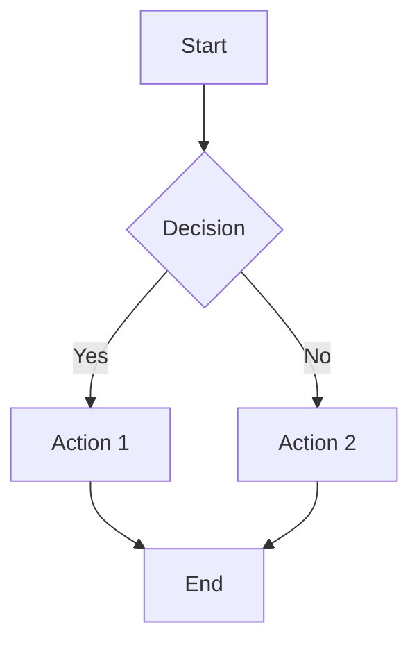

# Quickstart Guide: Contributing to the Textbook

**Date**: 2025-12-05
**Feature**: 001-robotics-textbook-mdx
**Audience**: Content contributors, technical writers, educators

## Overview

This guide walks you through setting up the development environment and contributing content to the Physical AI & Humanoid Robotics Textbook. Whether you're adding a new chapter, fixing code examples, or improving diagrams, this guide covers the essential workflow.

## Prerequisites

- **Git**: Version control (install from [git-scm.com](https://git-scm.com/))
- **Node.js**: v18.x or later (install from [nodejs.org](https://nodejs.org/))
- **npm**: Comes with Node.js
- **Text Editor**: VS Code recommended ([code.visualstudio.com](https://code.visualstudio.com/))
- **Markdown knowledge**: Basic familiarity with Markdown syntax

Optional but helpful:
- **ROS 2 Humble**: For validating code examples (install from [docs.ros.org](https://docs.ros.org/en/humble/Installation.html))
- **Python 3.10+**: For testing Python code examples
- **Docker**: For isolated testing environments

---

## Step 1: Clone Repository and Install Dependencies

### 1.1 Clone the Repository

```bash
git clone https://github.com/[org]/[repo].git
cd [repo]
```

Replace `[org]/[repo]` with the actual repository path.

### 1.2 Install Node.js Dependencies

```bash
npm install
```

This installs Docusaurus and all required plugins (search, KaTeX, Mermaid, etc.).

**Expected output**:
```
added 1234 packages in 30s
```

### 1.3 Verify Installation

```bash
npm run start
```

This launches a local development server. You should see:

```
[SUCCESS] Docusaurus website is running at: http://localhost:3000/
```

Open `http://localhost:3000` in your browser. You should see the textbook homepage.

**Stop the server**: Press `Ctrl+C` in the terminal.

---

## Step 2: Understand the Project Structure

```
├── docs/                    # All MDX content files
│   ├── intro.md            # Homepage
│   ├── module-1-ros2/      # Module 1 content
│   ├── module-2-simulation/
│   ├── module-3-isaac/
│   ├── module-4-vla/
│   ├── capstone/
│   └── resources/          # Appendices (glossary, hardware specs)
├── static/                  # Static assets
│   └── img/                # Images and diagrams
├── src/                     # Docusaurus config and components
│   ├── css/                # Custom styles
│   └── components/         # Custom React components
├── docusaurus.config.js     # Main configuration file
├── sidebars.js              # Sidebar navigation structure
└── package.json             # Node.js dependencies
```

**Key locations**:
- **Add/edit chapters**: `docs/module-{number}-{name}/`
- **Add images**: `static/img/`
- **Modify navigation**: `sidebars.js`
- **Configure site**: `docusaurus.config.js`

---

## Step 3: Create a New Chapter

Let's create a new chapter in Module 1 as an example.

### 3.1 Create the Chapter File

```bash
cd docs/module-1-ros2
touch 1-6-new-chapter.md
```

Replace `1-6` with the appropriate chapter number and `new-chapter` with a descriptive slug.

### 3.2 Add Frontmatter

Open `1-6-new-chapter.md` and add:

```yaml
---
id: 1-6-new-chapter
title: "Your Chapter Title"
sidebar_label: "Short Title"
sidebar_position: 6
description: "A 1-2 sentence summary of what this chapter covers (120-160 chars)"
keywords:
  - ros2
  - your-topic
  - relevant-keywords
difficulty: beginner
estimated_time: "30-45 minutes"
learning_outcomes:
  - "Explain [concept]"
  - "Implement [skill]"
prerequisites:
  - "1-1-ros2-intro"
  - "1-2-nodes-topics"
hardware_required: false
---
```

**Important**: Adjust all fields to match your chapter's content.

### 3.3 Write Content

Add your chapter content using Markdown/MDX:

```mdx
## Introduction

Start with context and motivation. Why is this topic important?

## Core Concepts

### Concept 1

Explain the concept clearly...

### Concept 2

Build on the previous concept...

## Code Example

```python title="example.py"
import rclpy
from rclpy.node import Node

class MyNode(Node):
    def __init__(self):
        super().__init__('my_node')
        self.get_logger().info('Node started')

def main():
    rclpy.init()
    node = MyNode()
    rclpy.spin(node)
    node.destroy_node()
    rclpy.shutdown()

if __name__ == '__main__':
    main()
```

**Dependencies**:
- `rclpy` (version 3.3.11): `pip install rclpy`
- ROS 2 Humble: [Installation guide](https://docs.ros.org/en/humble/Installation.html)

**Expected Output**:
```
[INFO] [my_node]: Node started
```

## Exercises

### Exercise 1: {Title}

**Difficulty**: Beginner
**Estimated Time**: 15-20 minutes
**Objective**: {What learner will accomplish}

**Instructions**:
1. Step one
2. Step two
3. Step three

**Validation**: {How to verify correctness}

<details>
<summary>Show Solution</summary>

```python
# Solution code here
```

**Explanation**: Why this solution works...

</details>

## Summary

Recap key takeaways from this chapter...

## Next Steps

Continue to [Next Chapter](./1-7-next-chapter.md) to learn about...
```

### 3.4 Add Chapter to Sidebar

Edit `sidebars.js` and add your chapter to the appropriate module:

```javascript
module.exports = {
  tutorialSidebar: [
    'intro',
    {
      type: 'category',
      label: 'Module 1: ROS 2',
      link: {type: 'doc', id: 'module-1-ros2/index'},
      items: [
        'module-1-ros2/1-1-ros2-intro',
        'module-1-ros2/1-2-nodes-topics',
        // ... existing chapters
        'module-1-ros2/1-6-new-chapter',  // <-- Add your chapter here
      ],
    },
    // ... rest of sidebar
  ],
};
```

### 3.5 Preview Your Changes

```bash
npm run start
```

Navigate to your new chapter in the browser to see how it looks.

---

## Step 4: Add Code Examples with Best Practices

### 4.1 Inline Code Examples

For short snippets (< 30 lines), embed directly in MDX:

````mdx
```python title="simple_publisher.py"
import rclpy
from std_msgs.msg import String

def main():
    rclpy.init()
    node = rclpy.create_node('publisher')
    pub = node.create_publisher(String, 'topic', 10)
    # ... rest of code
```
````

### 4.2 External Code Files

For longer examples (> 30 lines), store in `static/code/`:

```bash
mkdir -p static/code/module-1
```

Create `static/code/module-1/complete_publisher.py` with your code.

Reference in MDX:

```mdx
See the complete implementation:

- [Download complete_publisher.py](/code/module-1/complete_publisher.py)

```python title="complete_publisher.py (excerpt)"
# Show key sections in chapter, link to full file
import rclpy
# ...
```
````

### 4.3 Code Tabs for Alternatives

When showing multiple approaches (Python vs C++, Gazebo vs Unity):

```mdx
import Tabs from '@theme/Tabs';
import TabItem from '@theme/TabItem';

<Tabs>
  <TabItem value="python" label="Python" default>

```python
import rclpy
# Python implementation
```

  </TabItem>
  <TabItem value="cpp" label="C++">

```cpp
#include <rclcpp/rclcpp.hpp>
// C++ implementation
```

  </TabItem>
</Tabs>
```

---

## Step 5: Add Diagrams

### 5.1 Mermaid Diagrams

For flowcharts, sequence diagrams, state machines:

````mdx


**Figure 1.1**: Decision flow diagram
````

### 5.2 Image Files

For photos, screenshots, complex diagrams:

1. Save image to `static/img/diagrams/` (or appropriate subdirectory)
2. Use standard markdown image syntax:

```mdx


**Figure 1.2**: Robot hardware setup showing connections
```

**Image guidelines**:
- Format: PNG or SVG preferred
- Size: Max 1920px width, optimize for web (< 500KB)
- Naming: Descriptive kebab-case (`robot-kinematic-chain.svg`)
- Alt text: Describe content, not just "image" or "diagram"

### 5.3 Diagram Placeholders

If you can't create the diagram yet:

```mdx
:::info Diagram Placeholder: Robot Coordinate Frames
**Description**: 3D visualization showing robot with coordinate frames at each joint. Include X-Y-Z axes (RGB coloring), joint labels, and transformation matrices.

**Suggested Tool**: Blender or Inkscape
**Dimensions**: 1200x800px
**Alt Text**: "Robot arm with coordinate frames at shoulder, elbow, and wrist joints showing transformation hierarchy"
:::
```

---

## Step 6: Test Your Content Locally

### 6.1 Build Validation

Build the site to check for errors:

```bash
npm run build
```

**Success**: You should see "Success!" message with no errors.

**Common errors**:
- **MDX parse error**: Check your MDX syntax (closing tags, component imports)
- **Broken link**: Fix internal links (use relative paths)
- **Missing image**: Verify image path and file exists

### 6.2 Link Checking

Install and run link checker:

```bash
npm install -g markdown-link-check
find docs -name "*.md" -exec markdown-link-check {} \;
```

Fix any broken internal or external links.

### 6.3 Preview Both Themes

Click the theme toggle (moon/sun icon) in the top navigation to test both light and dark modes. Verify:
- Text is readable in both modes
- Code blocks display correctly
- Images/diagrams are visible (or have theme-specific versions)

---

## Step 7: Run Accessibility Checks

### 7.1 Lighthouse Audit

```bash
npm run build
npm run serve  # Starts production server on port 3000

# In another terminal:
npx @lhci/cli@0.12.x autorun --config=lighthouserc.js
```

**Target**: Accessibility score 90+

**Common issues**:
- Missing alt text on images
- Low color contrast
- Missing ARIA labels on custom components

### 7.2 Manual Keyboard Navigation

Test keyboard-only navigation:
1. Press `Tab` to move through interactive elements
2. Press `Enter` or `Space` to activate links/buttons
3. Verify all content is reachable without a mouse

---

## Step 8: Submit Your Contribution

### 8.1 Create a Git Branch

```bash
git checkout -b feature/add-chapter-1-6
```

Use descriptive branch names: `feature/`, `fix/`, `docs/`, etc.

### 8.2 Commit Your Changes

```bash
git add docs/module-1-ros2/1-6-new-chapter.md
git add sidebars.js
git add static/img/diagrams/your-diagram.png  # If you added images
git commit -m "docs: add Module 1 Chapter 6 - Your Topic

- Add detailed explanation of [concept]
- Include runnable code examples with dependencies
- Add exercise with solution
- Create architecture diagram"
```

**Commit message format**:
- Use imperative mood ("add" not "added" or "adds")
- Keep first line under 72 characters
- Add details in body if needed
- Reference issues if applicable (`Fixes #123`)

### 8.3 Push to Remote

```bash
git push origin feature/add-chapter-1-6
```

### 8.4 Create Pull Request

1. Go to repository on GitHub
2. Click "Compare & pull request"
3. Fill out PR template:
   - **Title**: Clear, descriptive summary
   - **Description**: What changed, why, how to test
   - **Checklist**: Mark completed items (code tested, links valid, etc.)
4. Request review from content team
5. Address review feedback

---

## Step 9: Code Example Testing (Optional)

If you're contributing code examples, test them in the documented environment:

### 9.1 Set Up ROS 2 Environment

```bash
# Ubuntu 22.04
sudo apt update
sudo apt install ros-humble-desktop
source /opt/ros/humble/setup.bash
```

### 9.2 Test Code Example

```bash
# Copy code from your chapter
cat > /tmp/test_node.py <<'EOF'
# Paste your code here
EOF

# Run it
python3 /tmp/test_node.py
```

### 9.3 Verify Output

Check that:
- Code runs without errors
- Output matches documented expected output
- Dependencies are correctly documented

### 9.4 Document Environment

In your chapter, document the exact environment:

```mdx
**Tested Environment**:
- OS: Ubuntu 22.04 LTS
- ROS 2: Humble Hawksbill
- Python: 3.10.6
- Additional packages: rclpy (3.3.11), std_msgs (4.2.3)
```

---

## Common Workflows

### Adding a New Module

1. Create module directory: `docs/module-{number}-{slug}/`
2. Create index file: `docs/module-{number}-{slug}/index.md` with frontmatter
3. Add module to `sidebars.js` as new category
4. Create first chapter
5. Update homepage (`docs/intro.md`) to reference new module

### Updating an Existing Chapter

1. Edit the chapter MDX file
2. Test locally (`npm run start`)
3. Run build validation (`npm run build`)
4. Commit and create PR

### Adding Images

1. Save to `static/img/{category}/`
2. Reference in MDX: ``
3. Verify image displays in both themes
4. Add descriptive alt text (WCAG requirement)

### Fixing Code Examples

1. Identify the broken example
2. Test fix in local ROS 2 environment
3. Update code in chapter
4. Update dependencies/environment notes if changed
5. Verify expected output is still correct

---

## Troubleshooting

### "Port 3000 already in use"

Kill existing server or use different port:

```bash
npm run start -- --port 3001
```

### "Cannot find module '@docusaurus/...'"

Reinstall dependencies:

```bash
rm -rf node_modules package-lock.json
npm install
```

### "MDX parse error"

Common causes:
- Unclosed JSX tags (`<Tabs>` without `</Tabs>`)
- Missing component import (forgot `import Tabs from '@theme/Tabs'`)
- Invalid MDX syntax (HTML inside code blocks)

Check the error message for line number and fix syntax.

### "Broken links detected"

Find and fix broken links:

```bash
npm run build 2>&1 | grep "Broken link"
```

Fix links using relative paths and verify files exist.

---

## Additional Resources

- **Docusaurus Documentation**: [docusaurus.io/docs](https://docusaurus.io/docs)
- **MDX Documentation**: [mdxjs.com](https://mdxjs.com/)
- **Mermaid Documentation**: [mermaid.js.org](https://mermaid.js.org/)
- **Content Structure Contracts**: `specs/001-robotics-textbook-mdx/contracts/content-structure.md`
- **Data Model**: `specs/001-robotics-textbook-mdx/data-model.md`
- **ROS 2 Documentation**: [docs.ros.org](https://docs.ros.org/)

---

## Questions or Issues?

- **Bug reports**: Open an issue on GitHub with reproduction steps
- **Content questions**: Tag `@content-team` in PR or issue
- **Technical help**: Tag `@maintainers` in PR or issue

Happy contributing! 🚀
