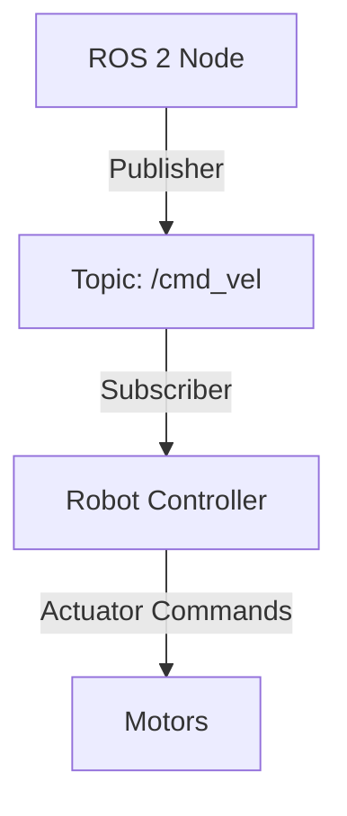

# Research: Physical AI & Humanoid Robotics Textbook

**Date**: 2025-12-05
**Feature**: 001-robotics-textbook-mdx
**Purpose**: Resolve technology choices and validate implementation approach

## Research Question 1: Docusaurus 3.x Configuration Best Practices

### Decision

Use Docusaurus 3.x with the following configuration:
- **Theme**: @docusaurus/theme-classic (standard docs theme)
- **Plugins**:
  - `@docusaurus/plugin-content-docs` (core documentation)
  - `@docusaurus/plugin-sitemap` (SEO)
  - `docusaurus-plugin-search-local` (local search - see RQ4)
  - `remark-math` + `rehype-katex` (mathematical equations)
- **Preset**: @docusaurus/preset-classic (bundles theme + core plugins)

### Rationale

- **Proven stability**: Classic theme is battle-tested by React docs, Jest, Babel, and hundreds of open-source projects
- **Built-in features**: Copy button, syntax highlighting (Prism), dark mode, sidebar, search integration all included
- **MDX 3 support**: Docusaurus 3.x uses MDX 3 with improved performance and better JSX support
- **KaTeX integration**: Official plugin support via remark-math/rehype-katex for mathematical notation
- **Customization balance**: Allows CSS customization without requiring React component overrides

### Alternatives Considered

- **Docusaurus 2.x**: Rejected - lacks MDX 3 performance improvements and some accessibility enhancements
- **Custom theme**: Rejected - unnecessary complexity; classic theme customization via CSS sufficient
- **VuePress/VitePress**: Rejected - smaller ecosystem, less suitable for React-heavy MDX components if needed later

### Implementation Notes

```javascript
// docusaurus.config.js key configuration
module.exports = {
  presets: [
    ['@docusaurus/preset-classic', {
      docs: {
        routeBasePath: '/',
        sidebarPath: require.resolve('./sidebars.js'),
        editUrl: 'https://github.com/[org]/[repo]/edit/main/',
        remarkPlugins: [require('remark-math')],
        rehypePlugins: [require('rehype-katex')],
      },
      theme: {
        customCss: require.resolve('./src/css/custom.css'),
      },
    }],
  ],
  stylesheets: [
    {
      href: 'https://cdn.jsdelivr.net/npm/katex@0.16.0/dist/katex.min.css',
      type: 'text/css',
      integrity: 'sha384-Xi8rHCmBmhbuyyhbI88391ZKP2dmfnOl4rT9ZfRI7mLTdk1wblIUnrIq35nqwEvC',
      crossorigin: 'anonymous',
    },
  ],
};
```

---

## Research Question 2: MDX Code Tab Patterns

### Decision

Use Docusaurus `@theme/Tabs` and `@theme/TabItem` components for multi-approach code examples:

```mdx
import Tabs from '@theme/Tabs';
import TabItem from '@theme/TabItem';

<Tabs>
  <TabItem value="gazebo" label="Gazebo" default>
    ```xml
    <!-- Gazebo world configuration -->
    <world name="default">
      <include><uri>model://ground_plane</uri></include>
    </world>
    ```
  </TabItem>
  <TabItem value="unity" label="Unity">
    ```csharp
    // Unity scene setup
    GameObject plane = GameObject.CreatePrimitive(PrimitiveType.Plane);
    ```
  </TabItem>
</Tabs>
```

### Rationale

- **Native support**: Tabs component built into Docusaurus with full accessibility (ARIA roles, keyboard navigation)
- **Synchronized tabs**: Docusaurus remembers tab selection across pages (e.g., if user prefers Gazebo, all tabs default to Gazebo)
- **Syntax highlighting preserved**: Code blocks within TabItem maintain full Prism highlighting
- **Mobile responsive**: Tabs automatically adapt to mobile screens
- **No custom build required**: Works out-of-box without plugins

### Alternatives Considered

- **Custom React tabs**: Rejected - reinventing the wheel, accessibility burden
- **Accordion pattern**: Rejected - doesn't convey "choose one approach" semantics as clearly
- **Side-by-side code blocks**: Rejected - poor mobile experience, doesn't scale to 3+ alternatives

### Implementation Notes

- Use `default` prop on first TabItem to set default selection
- Keep tab labels concise (< 10 characters)
- Ensure tabs contain comparable content (apples-to-apples comparisons)
- Document which approach is recommended in surrounding text

---

## Research Question 3: Collapsible Content Strategy

### Decision

Use Docusaurus **Admonitions** with collapsible flag for optional depth content:

```mdx
:::tip Advanced Topic - Quaternion Mathematics
<details>
<summary>Click to expand derivation</summary>

Detailed mathematical derivation here...

</details>
:::
```

And native HTML `<details>/<summary>` for simple collapsibles:

```mdx
<details>
<summary>Show hardware alternatives</summary>

- Option A: ...
- Option B: ...

</details>
```

### Rationale

- **WCAG compliant**: Both admonitions and details/summary are semantic HTML with proper ARIA support
- **SEO friendly**: Content in collapsed sections is still indexed by search engines
- **Markdown support**: Content inside details/summary can use full MDX/markdown syntax
- **Visual distinction**: Admonitions provide visual hierarchy (note, tip, warning, caution, danger, info)
- **No JavaScript required**: Works with JS disabled (progressive enhancement)

### Alternatives Considered

- **Custom collapsible component**: Rejected - native HTML better for accessibility and SEO
- **Always expanded advanced content**: Rejected - creates cognitive overload for beginners
- **Separate "advanced" pages**: Rejected - breaks learning flow, increases navigation complexity

### Implementation Notes

- Use admonitions + details for "advanced optional" content (derivations, theory deep-dives)
- Use plain details/summary for "reference information" (alternatives, troubleshooting)
- Keep summaries descriptive (not just "Click here" - specify what expands)
- Test keyboard navigation (Enter/Space to expand, Tab to move through)

---

## Research Question 4: Search Implementation

### Decision

Use **docusaurus-plugin-search-local** (local search plugin) instead of Algolia DocSearch.

### Rationale

- **Offline support**: Works without internet connection (critical for SC-017 progressive enhancement goal)
- **No external dependencies**: No API keys, no rate limits, no third-party service
- **Build-time indexing**: Search index generated during build, versioned with content
- **Privacy**: No search queries sent to external servers
- **Zero configuration**: Auto-indexes all docs content
- **Good enough quality**: Full-text search with basic relevance ranking sufficient for educational content
- **Open source**: MIT licensed, maintained by community

### Alternatives Considered

- **Algolia DocSearch**: Rejected despite superior search quality because:
  - Requires application approval (delay)
  - External dependency (violates offline goal)
  - Rate limiting for free tier
  - Privacy concerns (query tracking)
- **Typesense**: Rejected - requires running search server (violates static-only constraint)
- **Meilisearch**: Rejected - same server requirement issue

### Implementation Notes

```javascript
// docusaurus.config.js
module.exports = {
  themes: [
    [
      require.resolve('@easyops-cn/docusaurus-search-local'),
      {
        hashed: true,
        language: ['en'],
        highlightSearchTermsOnTargetPage: true,
        explicitSearchResultPath: true,
      },
    ],
  ],
};
```

Install: `npm install --save @easyops-cn/docusaurus-search-local`

---

## Research Question 5: Code Example Testing Strategy

### Decision

Multi-tier validation approach:

**Tier 1: Build-time Validation** (automated, every build)
- MDX syntax validation (Docusaurus build)
- Code block language identifiers validated
- Internal links checked (markdown-link-check in CI)

**Tier 2: Syntax Validation** (automated, every commit)
- Python code linted with `ruff` or `flake8`
- C++ code checked with `clang-format`
- Shell scripts validated with `shellcheck`
- No execution required - static analysis only

**Tier 3: Sample Execution** (manual, periodic)
- Maintain Docker containers with ROS 2 Humble, Gazebo, Unity environments
- Document maintainers manually run subset of examples each release
- Version pinning in code blocks ensures reproducibility

**Tier 4: Community Validation** (continuous, post-release)
- Issue reporting for non-working examples
- Periodic review of reported issues
- Version migration guides when tools update

### Rationale

- **Pragmatic**: Full CI execution of 150+ robotics examples impractical (requires GPUs, simulators, hardware)
- **Focuses on common errors**: Syntax errors caught by Tier 1-2 are most common issues
- **Scalable**: Doesn't require maintaining complex CI infrastructure
- **Relies on version pinning**: Explicit versions (Principle VI) make examples reproducible
- **Community feedback loop**: Learners report issues, improving content iteratively

### Alternatives Considered

- **Full CI execution**: Rejected - prohibitively expensive (GPU runners, simulator licenses), slow builds (5+ min → 30+ min)
- **Notebook-style execution**: Rejected - Jupyter integration would complicate MDX authoring
- **No validation**: Rejected - violates Principle I (accuracy) and SC-003 (90% first-attempt success)

### Implementation Notes

```yaml
# .github/workflows/validate.yml
name: Validate Content
on: [push, pull_request]
jobs:
  build:
    runs-on: ubuntu-latest
    steps:
      - uses: actions/checkout@v3
      - uses: actions/setup-node@v3
        with:
          node-version: 18
      - run: npm ci
      - run: npm run build  # Validates MDX syntax
      - run: npx markdown-link-check docs/**/*.md
      - run: find docs -name "*.py" -exec python -m py_compile {} \;
```

---

## Research Question 6: Diagram Generation and Placeholder Strategy

### Decision

Use **Mermaid.js** (built-in Docusaurus support) for:
- Flowcharts (system architecture, algorithm flows)
- Sequence diagrams (ROS message passing, API calls)
- State diagrams (robot state machines)

Use **detailed placeholders** for:
- Hardware photos (real robot components)
- Complex kinematic diagrams (3D transformations, DH parameters)
- Custom illustrations (UI mockups, physical setups)

### Rationale

- **Mermaid built-in**: Docusaurus 3.x includes Mermaid support via `@docusaurus/theme-mermaid`
- **Text-based**: Diagrams as code are version-controllable, searchable, and easy to update
- **Accessible**: Mermaid generates semantic SVG with ARIA labels
- **Good coverage**: Handles ~60% of diagram needs (system architectures, flows, state machines)
- **Graceful degradation**: Mermaid displays as code if JS disabled (still readable)

**Placeholder format**:
```mdx
:::info Diagram Placeholder: Robot Kinematic Chain
**Description**: Illustration showing humanoid robot with labeled joints (hip, knee, ankle) and coordinate frames. Include:
- 3D perspective view of robot standing upright
- X-Y-Z axes at each joint (right-hand rule)
- Joint angles labeled (θ1, θ2, θ3...)
- DH parameter table below diagram

**Suggested Tool**: Blender (3D render) or Inkscape (vector diagram)
**Dimensions**: 800x600px, light/dark mode compatible
**Alt Text**: "Humanoid robot kinematic chain showing 6-DOF leg with hip, knee, and ankle joints, coordinate frames, and DH parameters"
:::
```

### Alternatives Considered

- **PlantUML**: Rejected - requires Java runtime, slower rendering, less modern syntax
- **Excalidraw**: Rejected - not text-based (defeats version control benefits)
- **AI diagram generation**: Rejected - unreliable quality, may not depict technical accuracy
- **No diagrams**: Rejected - violates Principle IV (visual learning support)

### Implementation Notes

```javascript
// docusaurus.config.js
module.exports = {
  themes: ['@docusaurus/theme-mermaid'],
  markdown: {
    mermaid: true,
  },
};
```

Example Mermaid diagram:
````mdx

````

---

## Research Question 7: Deployment Pipeline

### Decision

Use **GitHub Pages** as primary deployment target, with **Vercel** as documented alternative.

### Rationale

**GitHub Pages selected because**:
- **Zero cost**: Free for public repositories (aligns with open-source goal)
- **Tight Git integration**: Deploys automatically on push to main branch
- **Simple setup**: GitHub Actions workflow provided by Docusaurus template
- **Custom domain support**: Free HTTPS with custom domains
- **Version history**: Previous deployments accessible via Git tags
- **No external accounts**: Uses existing GitHub authentication

**Vercel advantages** (why also document):
- **Faster builds**: Parallelized builds, edge caching
- **Preview deployments**: Every PR gets preview URL
- **Better analytics**: Build performance metrics, visitor analytics
- **Global CDN**: Better international performance

### Alternatives Considered

- **Netlify**: Rejected - similar to Vercel but less generous free tier, prefer GitHub's ecosystem integration
- **AWS S3 + CloudFront**: Rejected - requires AWS account, more complex setup, not beginner-friendly
- **Self-hosted**: Rejected - violates free deployment requirement, adds maintenance burden

### Implementation Notes

**GitHub Pages setup**:
```yaml
# .github/workflows/deploy.yml
name: Deploy to GitHub Pages
on:
  push:
    branches: [main]
jobs:
  deploy:
    runs-on: ubuntu-latest
    steps:
      - uses: actions/checkout@v3
      - uses: actions/setup-node@v3
        with:
          node-version: 18
      - run: npm ci
      - run: npm run build
      - uses: peaceiris/actions-gh-pages@v3
        with:
          github_token: ${{ secrets.GITHUB_TOKEN }}
          publish_dir: ./build
```

**Vercel setup** (documented alternative):
1. Import GitHub repository in Vercel dashboard
2. Framework preset: Docusaurus
3. Build command: `npm run build`
4. Output directory: `build`

---

## Research Question 8: Accessibility Testing Automation

### Decision

Implement three-layer accessibility validation:

**Layer 1: Lighthouse CI** (automated, every PR)
- Accessibility score threshold: 90+
- Catches: missing alt text, low contrast, missing ARIA labels
- Fast: ~30 seconds per page

**Layer 2: axe-core** (automated, every PR)
- More detailed WCAG 2.1 AA validation
- Catches: semantic HTML issues, keyboard navigation problems
- Integrated via `@axe-core/cli`

**Layer 3: Manual audit** (periodic, pre-release)
- Screen reader testing (NVDA/JAWS on Windows, VoiceOver on macOS)
- Keyboard-only navigation testing
- High-contrast mode testing
- Real assistive technology validation

### Rationale

- **Automated majority**: Layers 1-2 catch 80% of accessibility issues automatically
- **Fast feedback**: Fails PRs before human review if accessibility regresses
- **Comprehensive**: axe-core checks 50+ WCAG rules
- **Pragmatic**: Manual testing covers edge cases automation misses
- **Docusaurus advantage**: Framework has good baseline accessibility, focused testing on content

### Alternatives Considered

- **pa11y**: Rejected - slower than Lighthouse CI, similar coverage
- **Manual only**: Rejected - doesn't scale to 40-60 pages, misses regressions
- **Automated only**: Rejected - can't validate screen reader experience or keyboard flows

### Implementation Notes

```yaml
# .github/workflows/accessibility.yml
name: Accessibility Check
on: [pull_request]
jobs:
  audit:
    runs-on: ubuntu-latest
    steps:
      - uses: actions/checkout@v3
      - uses: actions/setup-node@v3
      - run: npm ci
      - run: npm run build
      - run: npm install -g @lhci/cli@0.12.x
      - run: lhci autorun --config=lighthouserc.js
      - run: npx @axe-core/cli build/**/*.html
```

```javascript
// lighthouserc.js
module.exports = {
  ci: {
    collect: {
      numberOfRuns: 3,
      startServerCommand: 'npm run serve',
      url: ['http://localhost:3000/'],
    },
    assert: {
      assertions: {
        'categories:accessibility': ['error', {minScore: 0.9}],
      },
    },
  },
};
```

---

## Summary of Technology Stack

Based on research conclusions:

| Component | Technology | Justification |
|-----------|-----------|---------------|
| **Static Site Generator** | Docusaurus 3.x | Industry standard for docs, MDX 3 support, extensive ecosystem |
| **Content Format** | MDX (Markdown + JSX) | Balance of simplicity (Markdown) and power (React components) |
| **Theme** | @docusaurus/theme-classic | Proven stability, built-in accessibility, customizable |
| **Search** | docusaurus-plugin-search-local | Offline support, privacy, zero external dependencies |
| **Math Rendering** | KaTeX (via remark-math/rehype-katex) | Fast, accessible, industry standard |
| **Diagrams** | Mermaid.js + detailed placeholders | Text-based diagrams for architecture/flows, placeholders for complex visuals |
| **Code Tabs** | Docusaurus @theme/Tabs | Built-in, accessible, synchronized across pages |
| **Collapsibles** | Admonitions + HTML details/summary | Semantic HTML, accessible, SEO-friendly |
| **Deployment** | GitHub Pages (primary), Vercel (alternative) | Free, automated, Git-integrated |
| **CI/CD** | GitHub Actions | Validates build, links, accessibility, syntax |
| **Accessibility** | Lighthouse CI + axe-core + manual testing | Comprehensive automated + human validation |
| **Code Validation** | Build-time (MDX) + static analysis (linters) | Pragmatic approach balancing automation and maintainability |

---

## Open Questions for Phase 1

1. **Code example organization**: Store inline in MDX or separate files in `static/code/`?
   - **Recommendation**: Inline for short examples (< 30 lines), separate files for complete programs

2. **Exercise solutions**: Separate files or collapsed sections?
   - **Recommendation**: Collapsed `<details>` sections to keep content together, separate file for extensive solutions

3. **Version migration strategy**: How to handle ROS 2 Humble → Iron → Jazzy transitions?
   - **Recommendation**: Document current version prominently, create migration guides as separate appendix pages when new versions stabilize

4. **Multi-language support**: Should we provide C++ and Python examples for ROS 2?
   - **Recommendation**: Python primary (lower barrier), C++ in tabs where performance matters (per Principle VI - alternatives)

These will be addressed in data-model.md and contracts/content-structure.md.
